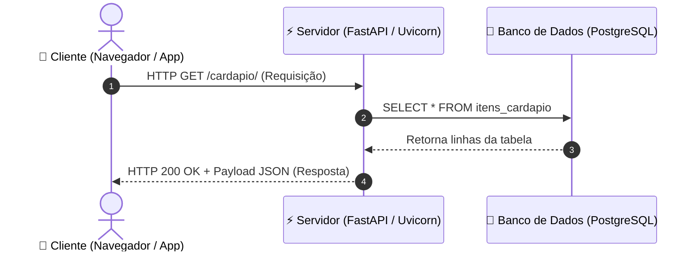
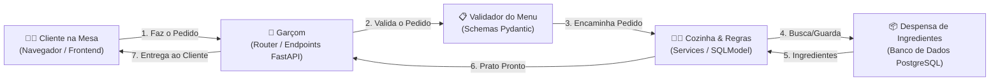
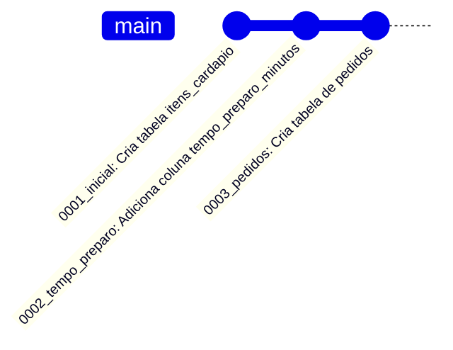
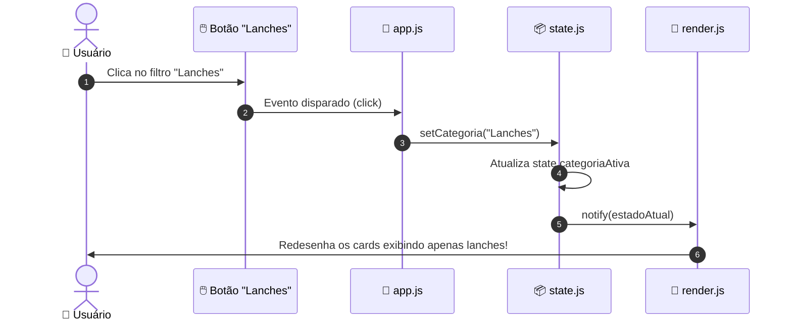
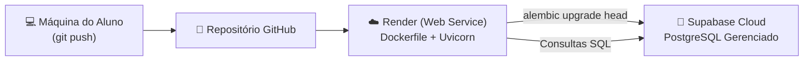

<!-- Slide 01: Capa -->
# 🍽️ Cardápio Digital
## Da Criação de APIs RESTful ao Deploy na Nuvem com Docker

**Disciplina:** Desenvolvimento Backend  
**Curso:** Técnico em Desenvolvimento de Sistemas (TDS 386 - 2026.2)  
**Professor:** Rogério Silva  
**Tecnologias:** FastAPI • SQLModel • PostgreSQL / Supabase • Alembic • Docker • Vanilla JS Reativo

---

<!-- Slide 02: Objetivos de Aprendizagem -->
## 🎯 Objetivos de Aprendizagem & Roteiro

Ao final desta sequência didática, você será capaz de:

1. Compreender o **ciclo de vida HTTP** (Requisição, Resposta, Verbos e Status Semânticos).
2. Construir **APIs RESTful profissionais com FastAPI** utilizando tipagem moderna do Python.
3. Modelar banco de dados relacional e validações sem duplicar código usando **SQLModel**.
4. Aplicar a arquitetura em camadas e **Injeção de Dependência (`Depends`)**.
5. Controlar a evolução do banco de dados na nuvem (**PostgreSQL / Supabase**) com **Alembic**.
6. Entender a base da **Programação Reativa no Frontend** com o padrão **Observer (Pub-Sub)**.
7. Conteinerizar e publicar aplicações na nuvem (**Docker no Render**).

---

<!-- Slide 03: Como a Web Funciona? -->
## 🌐 Como a Web Funciona? O Ciclo HTTP

Toda a comunicação moderna entre Frontend, Mobile e Backend ocorre através do protocolo **HTTP** (*Hypertext Transfer Protocol*):



- **Cliente (*Client*):** Envia uma **Requisição (*Request*)** contendo método, URL, headers e body.
- **Servidor (*Server*):** Processa a regra de negócio, acessa o banco e devolve uma **Resposta (*Response*)**.
- **Stateless:** Cada requisição HTTP é independente. O servidor não "guarda sessão" por padrão.

---

<!-- Slide 04: Anatomia do Pacote HTTP -->
## 📦 Anatomia de uma Requisição & Resposta HTTP

### O que o Cliente envia (Requisição):
- **Método / Verbo:** A intenção da ação (`GET`, `POST`, `PUT`, `PATCH`, `DELETE`).
- **Caminho / URL:** O recurso desejado (ex: `/cardapio/10`).
- **Cabeçalhos (*Headers*):** Metadados (ex: `Content-Type: application/json`).
- **Corpo (*Body / Payload*):** Dados em formato JSON (usado em POST, PUT e PATCH).

### O que o Backend devolve (Resposta):
- **Código de Status (*Status Code*):**
  - `200 OK`: Sucesso em leitura ou atualização.
  - `201 Created`: Novo recurso foi salvo com sucesso.
  - `204 No Content`: Sucesso sem conteúdo no corpo (comum em DELETE).
  - `400 Bad Request`: Requisição inválida por parte do cliente.
  - `404 Not Found`: O recurso com aquele ID não existe.
  - `422 Unprocessable Entity`: Erro de validação de tipos (FastAPI/Pydantic).

---

<!-- Slide 05: Por que FastAPI? -->
## ⚡ Por que FastAPI e Python Moderno?

O **FastAPI** tornou-se um dos três frameworks mais populares do mundo devido a:

1. **Velocidade Extrema:** Construído sobre Starlette e Pydantic, rivaliza em performance com NodeJS e Go.
2. **Type Hints Nativos do Python:**
   ```python
   def obter_item(item_id: int):  # O Python sabe que item_id DEVE ser inteiro!
   ```
   Se o cliente enviar `/cardapio/abc`, o FastAPI recusa **automaticamente** com status 422!
3. **Documentação Interativa Instantânea:**
   - Swagger UI: `http://localhost:8000/docs`
   - ReDoc: `http://localhost:8000/redoc`
4. **Assíncrono por Padrão (`async / await`):** Alta capacidade de requisições simultâneas.

---

<!-- Slide 06: O Protótipo Inicial -->
## 🐣 O Protótipo Inicial: Analisando o `main.py`

Na primeira aula de backend, começamos com um modelo direto e simples:

```python
from fastapi import FastAPI, HTTPException

app = FastAPI()

# Lista volátil de pratos em memória
itens = [
    {"id": 10, "nome": "Filé com Fritas", "disponivel": False},
    {"id": 15, "nome": "Pão c/ Carne de sol (3und)", "disponivel": True},
]

@app.get("/")
def raiz():
    return {"mensagem": "API cardápio no AR"}
```

<div class="box">
💡 <b>Observe:</b> Uma função Python comum decorada com <code>@app.get('/')</code> retorna um <code>dict</code> nativo, e o FastAPI converte automaticamente para JSON!
</div>

---

<!-- Slide 07: Path Params vs Query Params -->
## 🔍 Parâmetros de Rota (Path) vs Consulta (Query)

### 1. Path Parameter (Identificação Obrigatória)
Define **qual** recurso específico queremos acessar. Fica dentro do caminho da URL:
```python
# Requisição: GET /cardapio/15
@app.get("/cardapio/{item_id}")
def obter_item(item_id: int):
    # item_id recebe 15 convertido para int
```

### 2. Query Parameter (Filtro Opcional)
Define **como** queremos filtrar ou ordenar uma coleção. Vem após o ponto de interrogação (`?`):
```python
# Requisição: GET /cardapio/?categoria=Bebidas&disponivel=true
@app.get("/cardapio/")
def listar(categoria: str | None = None, disponivel: bool | None = None):
    # categoria recebe 'Bebidas' e disponivel recebe True
```

<div class="alert">
⚠️ <b>Pegadinha Clássica:</b> Se você não definir valor padrão (ex: <code>= None</code>) num Query Param, o FastAPI o tornará <b>obrigatório</b>, quebrando chamadas sem parâmetros!
</div>

---

<!-- Slide 08: Tratamento Semântico de Erros -->
## 🚨 Tratamento Semântico de Erros: `HTTPException`

Quando um cliente busca um ID que não existe, o backend **nunca** deve retornar erro 500 (falha interna) nem um JSON vazio com status 200:

```python
@app.get("/cardapio/{item_id}")
def obter_item(item_id: int):
    for item in itens:
        if item["id"] == item_id:
            return item

    # Lança semântica correta para o navegador e clientes HTTP
    raise HTTPException(
        status_code=status.HTTP_404_NOT_FOUND,
        detail=f"Item não localizado com id={item_id}."
    )
```

### Por que isso é fundamental?
- O navegador e o Frontend entendem imediatamente o código `404`.
- A mensagem em `detail` é enviada no padrão RFC 7807 para o cliente exibir um alerta claro.

---

<!-- Slide 09: O Problema dos Dados em Memória -->
## 🛑 O Limite do Protótipo: Dados em Memória

Armazenar dados numa lista Python global (`itens = [...]`) serve para aprender rotas, mas:

```python
# Problema 1: Reiniciou o Uvicorn? Todos os cadastros se perdem!
itens = [...] 

# Problema 2: Sem validação rigorosa de campos
itens.append({"preco": "caro demais"}) # Erro de tipo não interceptado!
```

### O que falta para uma aplicação real?
1. **Persistência Confiável:** Gravar no disco em um Banco de Dados Relacional.
2. **Validação de Tipos Rigorosa:** Bloquear dados absurdos (ex: preço negativo).
3. **Operações Completas de CRUD:** Cadastrar (`POST`), Editar (`PUT/PATCH`) e Excluir (`DELETE`).
4. **Isolamento e Segurança:** O cliente não pode escolher seu próprio ID primário!

---

<!-- Slide 10: Analogia do Restaurante -->
## 🎯 Analogia Didática: O Restaurante e as Camadas

Para entender como organizar um sistema de software, pense num restaurante real:



<div class="analogy">
<b>Lição de Arquitetura:</b> O cliente nunca entra na despensa (o frontend nunca acessa o banco direto). Quem vai até a despensa com regras e segurança é a cozinha (o backend)!
</div>

---

<!-- Slide 11: O Que é um ORM? -->
## 🗄️ O Que é um ORM (Object-Relational Mapping)?

Bancos relacionais (PostgreSQL/SQLite) pensam em **Tabelas, Linhas e Colunas SQL**:
```sql
SELECT id, nome, preco FROM itens_cardapio WHERE preco > 20.0;
```

A programação orientada a objetos no Python pensa em **Classes, Atributos e Instâncias**:
```python
prato.preco = 25.0
```

### O papel do ORM:
O ORM é o "tradutor simultâneo" que converte automaticamente linhas de tabelas SQL em instâncias de classes Python e vice-versa, sem exigir que você escreva SQL manual o tempo todo!

---

<!-- Slide 12: O Dilema Clássico: Pydantic vs SQLAlchemy -->
## ⚖️ O Dilema Clássico: Pydantic vs SQLAlchemy

Até pouco tempo atrás, desenvolvedores FastAPI sofriam com **duplicação de código**:

| Paradigma | Biblioteca | Como se declarava um campo |
| :--- | :--- | :--- |
| **Banco de Dados (ORM)** | SQLAlchemy | `nome = Column(String(100), nullable=False)` |
| **Validação da API (Schema)** | Pydantic | `nome: str = Field(min_length=2, max_length=100)` |

### Consequências:
- Escrever o modelo do prato **duas vezes** em arquivos diferentes.
- Se o prato ganhasse um novo atributo, tinha que lembrar de alterar nos dois mundos!
- Confusão constante para quem estava aprendendo desenvolvimento backend.

---

<!-- Slide 13: A Solução do SQLModel -->
## 💡 A Solução Genial: SQLModel

Criado por **Sebastián Ramírez** (o mesmo autor do FastAPI), o **SQLModel** combina o SQLAlchemy 2.0 e o Pydantic em uma única sintaxe declarativa!

```python
from sqlmodel import SQLModel, Field

# É Schema Pydantic E TAMBÉM pode ser Tabela de Banco!
class ItemCardapio(SQLModel, table=True):
    __tablename__ = "itens_cardapio"

    id: int | None = Field(default=None, primary_key=True)
    nome: str = Field(min_length=2, max_length=100)
    preco: float = Field(gt=0)
    categoria: str = Field(default="Lanches")
    disponivel: bool = Field(default=True)
```

<div class="box">
✨ <b>Poder Didático:</b> Com apenas type hints nativos do Python (<code>str</code>, <code>float</code>, <code>bool</code>), temos validação de dados e tabela no banco prontas!
</div>

---

<!-- Slide 14: Herança Inteligente de Schemas -->
## 🧬 Herança Inteligente: Base, Create e Response

Como evitar que o cliente envie um `id` arbitrário no cadastro? Usamos **Herança de Classes**:

```python
# 1. Base: Campos comuns a todos
class ItemCardapioBase(SQLModel):
    nome: str = Field(min_length=2, max_length=100)
    descricao: str | None = None
    preco: float = Field(gt=0)
    categoria: str = "Lanches"
    disponivel: bool = True

# 2. Tabela Real no Banco: Herda a Base + adiciona a Chave Primária (id)
class ItemCardapio(ItemCardapioBase, table=True):
    __tablename__ = "itens_cardapio"
    id: int | None = Field(default=None, primary_key=True)

# 3. Create (Payload do POST): Não tem id! O banco vai gerar!
class ItemCardapioCreate(ItemCardapioBase):
    pass

# 4. Response (O que a API devolve): Garante que o id estará presente!
class ItemCardapioResponse(ItemCardapioBase):
    id: int
```

---

<!-- Slide 15: Por Que DTOs e Schemas Separados? -->
## 🛡️ Segurança: Por que separar Entrada e Saída?

Imagine o que aconteceria se usássemos a mesma classe da tabela diretamente no endpoint de cadastro:

```python
# ❌ VULNERÁVEL:
@app.post("/cardapio/")
def criar_perigoso(item: ItemCardapio):  # ItemCardapio tem o campo 'id'
    ...
```

Um usuário mal-intencionado poderia enviar no JSON:
```json
{ "id": 1, "nome": "Hambúrguer Grátis", "preco": 0.01 }
```
E sobrescrever o prato de ID 1 existente no restaurante!

<div class="box">
🔒 <b>Boas Práticas (DTO - Data Transfer Object):</b><br>
Ao exigir <code>ItemCardapioCreate</code>, o FastAPI simplesmente <b>descarta qualquer 'id'</b> que o cliente tente forçar. A segurança da chave primária pertence estritamente ao banco de dados!
</div>

---

<!-- Slide 16: Analogia do Contrato de Cartório -->
## 🎯 Analogia Didática: O Contrato de Cartório

<div class="analogy">
<h3>📜 Pydantic Schemas são como Formulários de Cartório com Reconhecimento de Firma:</h3>
<ul>
  <li>Se você preencher um campo com letras onde pedia número, o tabelião (Pydantic) <b>rejeita na recepção</b> (HTTP 422).</li>
  <li>Nem chega na mesa do juiz (o banco de dados e suas regras de negócio nem são incomodados com dados inválidos).</li>
  <li><b>Resultado:</b> Menos processamento inútil, banco sempre íntegro e mensagens de erro claríssimas.</li>
</ul>
</div>

```text
Entrada JSON do Cliente
   │
   ▼
[ Schema Pydantic: Validação de Tipos, Tamanhos e Mínimos ] 
   │
   ├─► Falhou? ──► Retorna 422 com o campo exato e motivo do erro!
   │
   └─► Passou? ──► Entrega o objeto limpo e seguro para a rota processar.
```

---

<!-- Slide 17: Arquitetura em Camadas -->
## 🏗️ Arquitetura em Camadas no FastAPI

Conforme o projeto cresce, abandonamos o arquivo único e adotamos uma estrutura concisa e idiomática:

```text
cardapio-api/
├── app/
│   ├── config.py           # Configurações do ambiente (.env)
│   ├── database.py         # Conexão com a Engine e Sessão do Banco
│   ├── models.py           # Modelos de Banco e Schemas Pydantic
│   ├── routers/
│   │   └── cardapio.py     # Endpoints HTTP (/cardapio)
│   └── main.py             # Instância do FastAPI, CORS e Lifespan
├── frontend/               # Interface web reativa integrada
├── migrations/             # Histórico de alterações do banco (Alembic)
└── tests/                  # Testes automatizados com pytest
```

<div class="box">
🎯 <b>Princípio da Responsabilidade Única:</b> Cada pasta e arquivo tem uma missão bem definida. Modificações em regras de banco não afetam a lógica de rotas.
</div>

---

<!-- Slide 18: Injeção de Dependência (`Depends`) -->
## 💉 Injeção de Dependência (`Depends`): A Sessão do Banco

Como garantir que cada requisição HTTP abra uma conexão com o banco e **sempre a feche**, mesmo se houver um erro durante a execução?

```python
# app/database.py
def obter_sessao():
    """Função geradora com yield que controla o ciclo da conexão"""
    with Session(engine) as sessao:
        yield sessao  # Entrega a sessão para quem pediu e espera a rota terminar!
    # Aqui, ao final da requisição, a sessão é FECHADA automaticamente!
```

E no seu endpoint (`app/routers/cardapio.py`):
```python
@router.get("/")
def listar(sessao: Session = Depends(obter_sessao)):
    # O FastAPI injeta a sessão pronta para uso aqui!
    return sessao.exec(select(ItemCardapio)).all()
```

<div class="box">
💡 <b>Sem Vazamento de Memória:</b> O desenvolvedor não precisa lembrar de dar <code>sessao.close()</code> em todas as funções. O FastAPI cuida do ciclo de vida!
</div>

---

<!-- Slide 19: Operação POST e o Status 201 Created -->
## ➕ Operação `POST /cardapio/`

Cadastrando novos pratos com validação e persistência relacional:

```python
@router.post("/", response_model=ItemCardapioResponse, status_code=status.HTTP_201_CREATED)
def criar_item(dados: ItemCardapioCreate, sessao: Session = Depends(obter_sessao)):
    # 1. Converte o schema de entrada para o modelo de banco
    novo_item = ItemCardapio.model_validate(dados)

    # 2. Adiciona à transação atual
    sessao.add(novo_item)

    # 3. Grava definitivamente no banco (Gera o ID autoincremento)
    sessao.commit()

    # 4. Atualiza a instância com os valores gerados pelo banco
    sessao.refresh(novo_item)

    # 5. Retorna o item completo (incluindo o novo ID gerado)
    return novo_item
```

<div class="box">
⭐ <b>Status 201:</b> Padrão REST que sinaliza explicitamente que um novo recurso foi criado no servidor.
</div>

---

<!-- Slide 20: Operação GET com Filtros Dinâmicos -->
## 🔎 Operação `GET /cardapio/` com Filtros Dinâmicos

Consultando dados com múltiplos filtros opcionais sem quebrar a consulta:

```python
@router.get("/", response_model=list[ItemCardapioResponse])
def listar_cardapio(
    categoria: str | None = None,
    disponivel: bool | None = None,
    busca: str | None = None,
    sessao: Session = Depends(obter_sessao),
):
    query = select(ItemCardapio)

    if categoria:
        query = query.where(ItemCardapio.categoria == categoria)
    if disponivel is not None:
        query = query.where(ItemCardapio.disponivel == disponivel)
    if busca:
        query = query.where(ItemCardapio.nome.ilike(f"%{busca}%"))

    # Executa o SELECT no banco e retorna lista de resultados
    return sessao.exec(query.order_by(ItemCardapio.id)).all()
```

---

<!-- Slide 21: PUT vs PATCH -->
## 🔄 `PUT` vs `PATCH`: Qual a Diferença?

| Verbo | Propósito | Exemplo no nosso Cardápio |
| :--- | :--- | :--- |
| **`PUT`** | **Substituição / Edição Geral:** Atualiza todos os dados do prato (nome, preço, descrição...). | `PUT /cardapio/10`<br>`{ "nome": "Novo Nome", "preco": 39.0, ... }` |
| **`PATCH`** | **Modificação Parcial Rápida:** Altera um único estado específico sem precisar reenviar o prato inteiro. | `PATCH /cardapio/10/disponibilidade`<br>*(Sem body! Apenas inverte de disponível para esgotado)* |

### No código do nosso PATCH (`cardapio.py`):
```python
@router.patch("/{item_id}/disponibilidade")
def alternar(item_id: int, sessao: Session = Depends(obter_sessao)):
    item = sessao.get(ItemCardapio, item_id)
    if not item: raise HTTPException(404)
    item.disponivel = not item.disponivel  # Inverte o booleano
    sessao.commit()
    return item
```

---

<!-- Slide 22: DELETE e o 204 No Content -->
## 🗑️ Operação `DELETE` e o Código 204 No Content

Ao excluir um prato com sucesso, o que devemos devolver no corpo da resposta?

```python
@router.delete("/{item_id}", status_code=status.HTTP_204_NO_CONTENT)
def remover_item(item_id: int, sessao: Session = Depends(obter_sessao)):
    item = sessao.get(ItemCardapio, item_id)
    if not item:
        raise HTTPException(status_code=404, detail="Item não localizado.")

    sessao.delete(item)
    sessao.commit()
    return None  # Não retorna conteúdo (HTTP 204)
```

<div class="box">
💡 <b>Conceito Semântico HTTP 204:</b><br>
Significa: <i>"A operação foi concluída com absoluto sucesso, e não há dados adicionais a enviar no corpo da resposta."</i> Isso economiza banda e segue o padrão REST mundial.
</div>

---

<!-- Slide 23: SQLite vs PostgreSQL -->
## 🐘 SQLite (Local) vs PostgreSQL (Nuvem)

| Característica | SQLite | PostgreSQL (Supabase) |
| :--- | :--- | :--- |
| **Tipo** | Embutido em arquivo (`cardapio.db`) | Servidor Client-Server dedicado |
| **Instalação** | Zero. Já vem no Python! | Requer serviço ou container Docker |
| **Ideal para...** | Primeiras aulas, testes rápidos e protótipos | Sistemas reais, produção e nuvem |
| **Concorrência** | Limita escritas simultâneas | Altíssima performance com milhares de conexões |

<div class="analogy">
🚗 <b>Analogia:</b> O SQLite é como uma bicicleta: leve, prática, vai em qualquer lugar sem combustível. O PostgreSQL é como um caminhão pesado: transporta cargas imensas com segurança total na rodovia!
</div>

---

<!-- Slide 24: Twelve-Factor App & .env -->
## 🔐 Twelve-Factor App (Fator III: Configurações no .env)

### ⚠️ Regra de Ouro da Segurança em TI:
**NUNCA, em hipótese alguma, comite senhas, tokens ou URLs de banco no Git!**

### Como resolvemos?
1. **`.env`:** Arquivo com suas credenciais reais. **Fica no `.gitignore`!**
2. **`.env.example`:** Arquivo modelo versionado no Git com valores fictícios.
3. **`app/config.py`:** Usa `pydantic-settings` para ler as variáveis:

```python
# app/config.py
class Settings(BaseSettings):
    DATABASE_URL: str = "sqlite:///./cardapio.db"
    ENVIRONMENT: str = "development"
    DEBUG: bool = True

    model_config = SettingsConfigDict(env_file=".env")

settings = Settings()
```

---

<!-- Slide 25: O Problema de create_all() -->
## ❓ Por que `create_all()` Não Serve para Produção?

No início do curso, usamos:
```python
SQLModel.metadata.create_all(engine)
```

### O que acontece se depois de 3 meses você adicionar um campo no modelo?
```python
class ItemCardapio(SQLModel, table=True):
    ...
    tempo_preparo_minutos: int | None = None # Novo atributo!
```

O `create_all()` executa apenas `CREATE TABLE IF NOT EXISTS`. Se a tabela já existir no banco, ele **ignora silenciosamente**! A nova coluna **NÃO é criada** no PostgreSQL e sua aplicação quebra!

<div class="alert">
🔥 <b>A Solução da Indústria:</b> Ferramentas de <b>Migração de Banco de Dados</b>. No ecossistema Python/SQLAlchemy, essa ferramenta chama-se <b>Alembic</b>.
</div>

---

<!-- Slide 26: Alembic em Ação -->
## 🔄 Alembic: O "Git" do Banco de Dados

Assim como o Git versiona o seu **código-fonte** com commits, o **Alembic** versiona a **estrutura do seu banco de dados (DDL)** com migrações:



### O que o Alembic faz?
- Mantém uma tabela chamada `alembic_version` no banco para saber em qual versão ele está.
- Permite avançar para a versão mais recente (`alembic upgrade head`).
- Permite desfazer alterações com rollback (`alembic downgrade -1`).

---

<!-- Slide 27: Evolução de Esquema na Prática -->
## 🛠️ Evolução de Esquema na Prática

Vejamos a migração que adicionou `tempo_preparo_minutos` no nosso projeto (`migrations/versions/0002_adiciona_tempo_preparo.py`):

```python
def upgrade() -> None:
    """Avança: Adiciona a nova coluna sem apagar os pratos existentes"""
    with op.batch_alter_table('itens_cardapio', schema=None) as batch_op:
        batch_op.add_column(
            sa.Column('tempo_preparo_minutos', sa.Integer(), nullable=True)
        )

def downgrade() -> None:
    """Desfaz: Remove a coluna se for necessário fazer rollback"""
    with op.batch_alter_table('itens_cardapio', schema=None) as batch_op:
        batch_op.drop_column('tempo_preparo_minutos')
```

<div class="box">
⭐ <b>Zero Downtime:</b> Todos os pratos cadastrados continuam intactos no banco. A coluna é adicionada preenchida com <code>NULL</code> de forma transparente!
</div>

---

<!-- Slide 28: Comandos Essenciais do Alembic -->
## 💻 Comandos Essenciais do Alembic para a Aula

No terminal do projeto, execute:

```bash
# 1. Aplicar todas as migrações pendentes no banco (Local ou Supabase)
alembic upgrade head

# 2. Ver em qual revisão o banco está agora
alembic current

# 3. Ver todo o histórico de migrações
alembic history --verbose

# 4. Desfazer a última alteração (Rollback)
alembic downgrade -1

# 5. Criar uma nova migração automaticamente após editar models.py
alembic revision --autogenerate -m "adiciona_campo_x"
```

---

<!-- Slide 29: Estado Centralizado no Frontend -->
## 🧠 Frontend Reativo: O Conceito de Estado (*State*)

Nos frameworks modernos (React, Vue, Svelte) e no nosso frontend Vanilla, a interface gráfica é uma **projeção visual do Estado**:

```mermaid
flowchart LR
    ESTADO["📦 ESTADO (state.js)\n{ itens: [...], filtro: 'Bebidas' }"] 
    -->|Transformação Pura| 
    TELA["🖥️ TELA (render.js)\nCards desenhados no DOM"]
```

### O que NÃO fazer (Estilo antigo / desorganizado):
- Ter botões que alteram textos em elementos do DOM diretamente espalhados pelo código.

### O que FAZER (Arquitetura Reativa):
- O botão apenas altera o **Estado** (`state.categoria = 'Bebidas'`).
- O Estado avisa a tela: *"Eu mudei, por favor desenhe novamente!"*.

---

<!-- Slide 30: Padrão Observador (Observer / Pub-Sub) -->
## 📢 O Padrão Observador (*Observer / Pub-Sub*)

Implementamos em [`frontend/state.js`](file:///Users/rogerio410/ifpi-tds-386-2026.2-backend/cardapio-api/frontend/state.js) o mesmo padrão que dá vida aos frameworks:

```javascript
// 1. Lista de inscritos
const listeners = [];

// 2. Função de Inscrição
export function subscribe(listener) {
    listeners.push(listener);
}

// 3. Função de Notificação (Propagação de Mudanças)
export function notify() {
    const estado = getState();
    listeners.forEach(fn => fn(estado)); // Avisa todos os inscritos!
}

// 4. Mutator (Setter)
export function setCategoria(novaCategoria) {
    state.categoriaAtiva = novaCategoria;
    notify(); // <-- Dispara a renderização automática!
}
```

---

<!-- Slide 31: A Divisão dos 4 Módulos do Frontend -->
## 🧩 Os 4 Módulos Especializados do Frontend

```text
frontend/
├── state.js      # O Coração: Guarda os dados, subscribe() e notify()
├── api.js        # A Rede: fetch() puro para GET, POST, PUT, DELETE
├── render.js     # Os Olhos: Recebe o estado e desenha cards e modais
└── app.js        # O Cérebro: Conecta eventos de clique às ações
```

<div class="box">
🎯 <b>Desacoplamento Didático:</b><br>
- <code>api.js</code> não sabe o que é um botão ou card no HTML.<br>
- <code>render.js</code> não sabe o que é uma requisição HTTP.<br>
- <code>app.js</code> orquestra a comunicação entre os módulos!
</div>

---

<!-- Slide 32: O Ciclo Reativo Completo -->
## 🔁 O Ciclo Reativo Completo

Veja o caminho percorrido desde o clique do mouse até a mudança na tela:



<div class="box">
💡 <b>Sem recarregar a página (SPA):</b> Tudo ocorre de forma instantânea e fluida no navegador do usuário!
</div>

---

<!-- Slide 33: Por Que Containers e Docker? -->
## 🐳 Por Que Containers? O Fim do "Na Minha Máquina Funciona"

### O pesadelo do desenvolvimento tradicional:
- *"Na máquina do professor funciona, no notebook do aluno falta biblioteca!"*
- *"No Mac do João a versão do Python é 3.13, no Windows da Maria é 3.10."*

### A solução com Docker:
Um container empacota **tudo** o que a aplicação precisa para rodar:
- O Sistema Operacional Linux mínimo.
- A versão exata do Python (3.13).
- Todas as bibliotecas do `requirements.txt`.
- O seu código-fonte e migrações.

<div class="box">
📦 <b>Garantia:</b> Se o container rodou no seu computador, ele rodará <b>exatamente igual</b> no servidor da nuvem (Render, AWS, GCP, Azure)!
</div>

---

<!-- Slide 34: Anatomia do Nosso Dockerfile -->
## 📝 Anatomia do Nosso `Dockerfile`

Veja como preparamos a imagem no projeto ([`Dockerfile`](file:///Users/rogerio410/ifpi-tds-386-2026.2-backend/cardapio-api/Dockerfile)):

```dockerfile
FROM python:3.13-slim               # 1. Base Linux leve e segura
WORKDIR /app                       # 2. Pasta de trabalho no container

COPY requirements.txt .             # 3. Copia apenas dependências primeiro
RUN pip install --no-cache-dir -r requirements.txt # (Aproveita cache do Docker!)

COPY app/ ./app/                   # 4. Copia o código da aplicação
COPY frontend/ ./frontend/
COPY migrations/ ./migrations/
COPY alembic.ini .
COPY main.py .

# 5. Roda as migrações no banco e sobe o servidor na porta da nuvem!
CMD ["sh", "-c", "alembic upgrade head && uvicorn main:app --host 0.0.0.0 --port ${PORT:-8000}"]
```

---

<!-- Slide 35: Deploy na Prática: Render + Supabase -->
## 🚀 Deploy na Prática: Render + Supabase



### Roteiro em 3 Passos:
1. **Supabase:** Criar projeto gratuito e copiar a Connection String URI.
2. **Render:** Criar **New Web Service** conectado ao repositório GitHub.
3. **Variável de Ambiente:** Definir `DATABASE_URL` com a URL do Supabase.
   - O Render compila a imagem Docker, roda as migrações e entrega HTTPS grátis!

---

<!-- Slide 36: Resumo da Jornada & Desafios -->
## 🏆 Resumo da Jornada & Desafios para a Turma

### O que construímos juntos:
1. ✅ **API RESTful completa** com FastAPI, validação Pydantic e Swagger automático.
2. ✅ **Modelagem unificada** com SQLModel sem duplicação de classes.
3. ✅ **Banco de dados relacional** com PostgreSQL e migrações versionadas via Alembic.
4. ✅ **Segurança Twelve-Factor** com credenciais isoladas em `.env`.
5. ✅ **Frontend reativo** com arquitetura em camadas e padrão Observer.
6. ✅ **Deploy na nuvem** conteinerizado com Docker, Render e Supabase.

### 🚀 Desafios Extras para Praticar:
- **Desafio 1:** Adicionar um campo `foto_url` no modelo e exibi-la nos cards do frontend.
- **Desafio 2:** Criar uma rota para buscar itens por faixa de preço (`preco_min` e `preco_max`).
- **Desafio 3:** Criar uma nova tabela `pedidos` com relacionamento 1:N com `itens_cardapio`.

---
<!-- Fim da Apresentação -->
