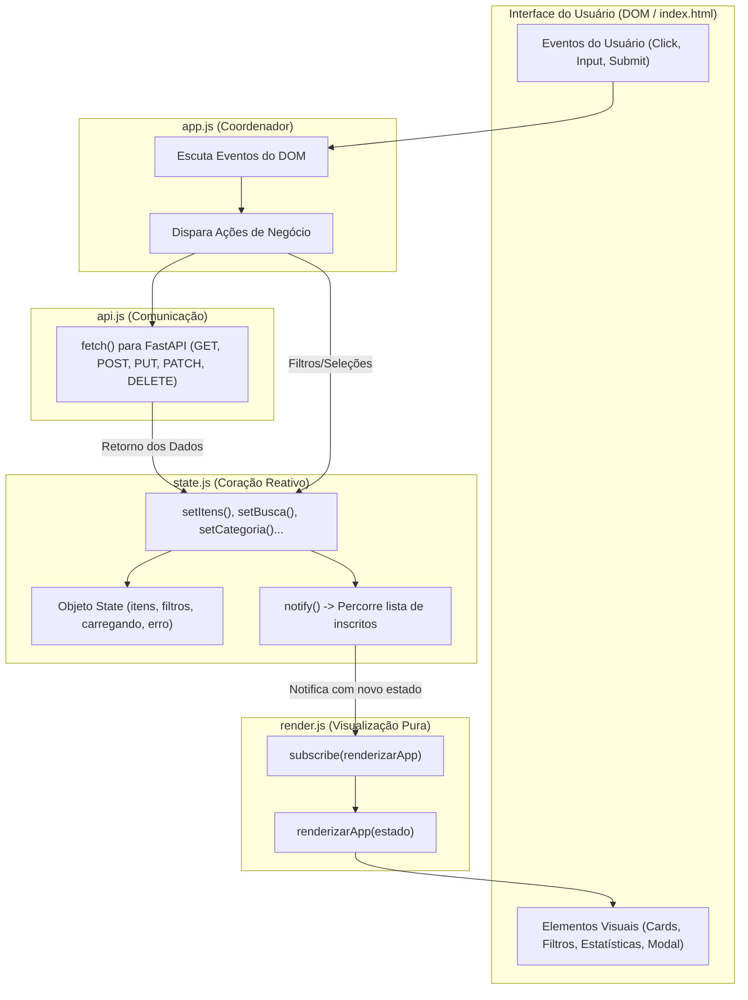

# Plano de Implementação Didática: Frontend Reativo com Estado e Propagação de Mudanças

## Visão Geral do Projeto Didático
Atualmente, o frontend do projeto manipula o DOM diretamente em cada função assíncrona (misturando regras de negócio, chamadas de rede e renderização). 

Nesta etapa, implementaremos o conceito fundamental que dá base aos frameworks modernos (React, Vue, Angular, Svelte), **mas sem instalar nenhuma dependência ou biblioteca externa**, apenas com **JavaScript puro (Vanilla)**:
1. **Estado Centralizado (*Single Source of Truth*)**: Os dados da aplicação ficam em um único lugar.
2. **Padrão Observador (*Observer Pattern / Pub-Sub*)**: Mudanças no estado disparam notificações automáticas (`notify()`).
3. **Assinantes (*Subscribers*)**: A interface gráfica se "inscreve" (`subscribe()`) para ser re-renderizada automaticamente sempre que o estado muda.
4. **Separação Rígida de Responsabilidades**: 4 módulos especializados (`state.js`, `api.js`, `render.js`, `app.js`).

---

## Diagrama da Arquitetura Reativa



---

## User Review Required

> [!IMPORTANT]
> **Adoção de ES Modules (`type="module"`)**:
> Utilizaremos `import` e `export` nativos do JavaScript moderno. Para que os navegadores carreguem módulos sem restrições de segurança do protocolo `file://`, disponibilizaremos duas formas de execução simples:
> 1. Servidor estático integrado no FastAPI (`app.mount("/frontend", ...)`), permitindo acessar direto por `http://127.0.0.1:8000/frontend/`.
> 2. Execução via `python -m http.server 3000 --directory frontend` ou extensão *Live Server* do VS Code.

> [!NOTE]
> **Substituição de `onclick` inline no HTML**:
> Os atributos legados `onclick="..."` no `index.html` serão substituídos por seletores e **delegação de eventos** em `app.js`, demonstrando aos alunos boas práticas de desacoplamento entre HTML e JavaScript.

---

## Estrutura de Arquivos Proposta

```text
cardapio-api/
├── frontend/
│   ├── index.html          # HTML limpo (marcação e Tailwind, sem JS inline)
│   ├── state.js            # [NOVO] Estado centralizado, notify(), subscribe() e setters
│   ├── api.js              # [NOVO] Funções puras de consumo da API (Fetch API)
│   ├── render.js           # [NOVO] Funções de renderização que recebem o Estado
│   └── app.js              # [REFATORADO] Ponto de entrada, binding de eventos e inicialização
├── app/
│   └── main.py             # [AJUSTE] Montagem de arquivos estáticos para abrir frontend direto na porta 8000
└── tests/
    └── test_cardapio.py    # Testes automatizados mantidos 100% funcionais
```

---

## Proposed Changes

---

### Componente 1: Estado Centralizado e Reatividade

#### [NEW] `frontend/state.js`
Responsável por conter a única fonte de verdade da aplicação e o mecanismo de publicação/assinatura:

- **Estrutura do Estado**:
  ```javascript
  const state = {
      itens: [],              // Lista completa de pratos retornada da API
      categoriaAtiva: "",     // "" (Todos), "Lanches", "Bebidas", "Sobremesas"
      filtroDisponivel: false,// true | false
      busca: "",              // Termo digitado no campo de pesquisa
      carregando: false,      // Feedback de loading
      erro: null,             // Mensagem de erro de rede ou validação
      itemEmEdicao: null,     // Objeto do item sendo editado no modal (ou null para novo)
      modalAberto: false      // Controle de visibilidade do modal
  };
  ```
- **Mecanismo Observer**:
  - `listeners = []`: Array de funções inscritas.
  - `subscribe(fn)`: Registra uma nova função para ser notificada sempre que o estado mudar.
  - `notify()`: Dispara todas as funções inscritas passando `getState()`.
  - `getState()`: Retorna uma cópia congelada/segura do estado (`structuredClone` ou cópia rasa protegida).
- **Mutators (Setters)** com comentários didáticos:
  - `setItens(itens)`
  - `setCategoria(categoria)`
  - `setFiltroDisponivel(booleano)`
  - `setBusca(termo)`
  - `setCarregando(booleano)`
  - `setErro(mensagem)`
  - `abrirModalNovo()`
  - `abrirModalEdicao(item)`
  - `fecharModal()`

---

### Componente 2: Camada de Comunicação com a API

#### [NEW] `frontend/api.js`
Funções assíncronas puras, isoladas de qualquer lógica visual ou de estado:

- `const BASE_URL = "http://127.0.0.1:8000";`
- `listarCardapio({ categoria, disponivel, busca })`: Realiza `GET /cardapio/` com parâmetros na URL.
- `obterItemPorId(id)`: Realiza `GET /cardapio/{id}`.
- `cadastrarItem(dados)`: Realiza `POST /cardapio/` com cabeçalho `Content-Type: application/json`.
- `atualizarItem(id, dados)`: Realiza `PUT /cardapio/{id}`.
- `alternarDisponibilidade(id)`: Realiza `PATCH /cardapio/{id}/disponibilidade`.
- `removerItem(id)`: Realiza `DELETE /cardapio/{id}`.

---

### Componente 3: Camada de Renderização Pura

#### [NEW] `frontend/render.js`
Funções que recebem o `estado` e atualizam o DOM de forma declarativa e previsível:

- `renderizarApp(estado)`: Função principal que chama todas as sub-renderizações:
  - `renderizarEstatisticas(estado)`: Atualiza contadores (Total, Disponíveis, Esgotados).
  - `renderizarFiltros(estado)`: Atualiza a aparência dos botões de categoria (qual está ativo) e o checkbox de disponíveis.
  - `renderizarCards(estado)`: Filtra os itens conforme `categoriaAtiva`, `filtroDisponivel` e `busca`, e desenha os cards ou mensagem de vazio.
  - `renderizarModal(estado)`: Abre/fecha o modal e preenche os campos caso `itemEmEdicao` esteja definido.
  - `renderizarFeedback(estado)`: Mostra/esconde banner de erro ou indicador de carregamento.

---

### Componente 4: Coordenador da Aplicação

#### [MODIFY] `frontend/app.js`
Arquivo principal que conecta todas as partes:

- Importa `state.js`, `api.js` e `render.js`.
- **Inscrição Reativa**:
  ```javascript
  // Sempre que o estado mudar, a interface é re-renderizada automaticamente!
  subscribe(renderizarApp);
  ```
- **Vinculação de Eventos (Event Listeners)**:
  - Evento de busca com debounce atualizando `setBusca()`.
  - Cliques nos botões de categoria chamando `setCategoria()`.
  - Mudança no checkbox chamando `setFiltroDisponivel()`.
  - Delegação de clique no grid de cards para identificar ações:
    - Botão alternar: chama `api.alternarDisponibilidade()`, recarrega dados e atualiza estado.
    - Botão editar: chama `abrirModalEdicao(item)`.
    - Botão excluir: confirma e chama `api.removerItem()`.
  - Submissão do formulário do modal: envia `api.cadastrarItem()` ou `api.atualizarItem()` e fecha modal.
- **Startup**:
  - Função `iniciar()` chamada no `DOMContentLoaded`, dispara `setCarregando(true)`, busca dados via `api.listarCardapio()` e salva com `setItens()`.

---

### Componente 5: Ajuste no HTML e Suporte a Arquivos Estáticos

#### [MODIFY] `frontend/index.html`
- Carregar o script principal como módulo ES:
  ```html
  <script type="module" src="app.js"></script>
  ```
- Remoção de handlers inline (`onclick="filtrarCategoria(...)"`, `onsubmit="salvarItem(event)"`, etc.) substituídos por `id`s e `data-*` attributes semânticos.

#### [MODIFY] `app/main.py`
- Adicionar montagem de arquivos estáticos:
  ```python
  from fastapi.staticfiles import StaticFiles
  # Permite acessar o frontend diretamente por http://127.0.0.1:8000/frontend/
  app.mount("/frontend", StaticFiles(directory="frontend", html=True), name="frontend")
  ```

---

## Plano de Verificação

### 1. Testes Automatizados (Garantia de Não-Regressão no Backend)
```bash
.venv/bin/pytest -v
```
Garante que a API continue 100% estável e respondendo corretamente.

### 2. Verificação do Fluxo Reativo no Navegador
1. Iniciar o backend:
   ```bash
   uvicorn main:app --reload --port 8000
   ```
2. Acessar `http://127.0.0.1:8000/frontend/` (ou via Live Server).
3. Testar a propagação reativa:
   - **Filtro de Categoria**: Clicar em "Bebidas" $\rightarrow$ O botão fica destacado e os cards atualizam instantaneamente através de `notify()`.
   - **Busca em Tempo Real**: Digitar "caju" $\rightarrow$ Cards filtram em tempo real sem recarregar página.
   - **Alternar Disponibilidade**: Clicar no botão de status $\rightarrow$ Badge muda de cor e contadores numéricos de estatísticas atualizam automaticamente.
   - **Criar Novo Prato**: Abrir modal, preencher e salvar $\rightarrow$ Modal fecha sozinho, prato aparece na lista e contador sobe.
   - **Simular Erro**: Parar o servidor Uvicorn e tentar recarregar $\rightarrow$ O estado transita para `erro` e o banner vermelho é renderizado reativamente.
