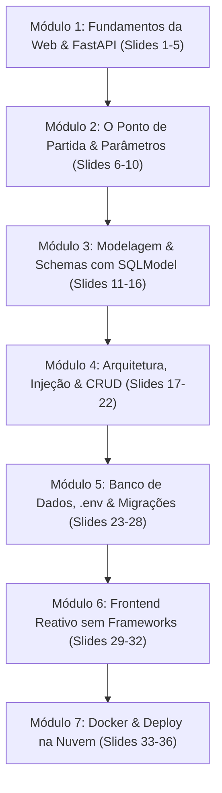

# Plano Pedagógico: Elaboração do Material de Aula Completo (36 Slides)

## Visão Geral do Material Didático
O objetivo é construir uma apresentação didática completa, moderna e aprofundada para os alunos do curso Técnico em Desenvolvimento de Sistemas (IFPI TDS 386 - 2026.2).

O material utilizará como base todo o código real desenvolvido no projeto `cardapio-api`, estruturando o aprendizado de forma progressiva:
1. **Fundamentos HTTP e Protocolo Web**: O ciclo de requisição e resposta.
2. **FastAPI e Type Hints**: Criação dos primeiros endpoints e documentação automática.
3. **Modelagem Unificada com SQLModel**: Pydantic Schemas vs Tabelas de Banco (ORM).
4. **Arquitetura em Camadas & Injeção de Dependência**: Separação de responsabilidades e `Depends()`.
5. **Banco de Dados, .env e Migrações (Alembic)**: Evolução segura de schema, Twelve-Factor e PostgreSQL/Supabase.
6. **Frontend Reativo Desacoplado**: Conceito de Estado Centralizado e Padrão Observer (Pub-Sub) sem frameworks.
7. **Deploy Profissional com Docker & Nuvem**: Containerização com Render e Supabase.

---

## Estrutura da Apresentação (36 Slides Didáticos)

---

## Grade Detalhada Slide a Slide

### Módulo 1: Introdução & Fundamentos da Web
- **Slide 01:** Capa: *Cardápio Digital: Da API REST ao Deploy na Nuvem*
- **Slide 02:** Roteiro da Aula & Competências a Desenvolver
- **Slide 03:** Como a Web Funciona? O Ciclo de Requisição e Resposta HTTP
- **Slide 04:** Anatomia do Pacote HTTP: Métodos, Headers, Body e Status Codes
- **Slide 05:** Por que FastAPI e Python? (Velocidade, Tipagem e Swagger Automático)

### Módulo 2: O Ponto de Partida & Parâmetros
- **Slide 06:** O Protótipo Inicial: Analisando o `main.py` embrionário
- **Slide 07:** Parâmetros de Rota (Path Params) vs Parâmetros de Busca (Query Params)
- **Slide 08:** Tratamento Semântico de Erros: `HTTPException` e o 404 Not Found
- **Slide 09:** O Problema dos Dados Voláteis em Memória
- **Slide 10:** *Analogia Didática:* O Restaurante, o Garçom e a Cozinha

### Módulo 3: Modelagem, Schemas e ORM com SQLModel
- **Slide 11:** O Que é um ORM? Mapeando Tabelas para Classes Python
- **Slide 12:** O Dilema: Schemas Pydantic (Validação) vs Modelos ORM (Banco)
- **Slide 13:** A Solução Genial do SQLModel: Unificando Dois Mundos
- **Slide 14:** Herança de Classes: `ItemCardapioBase`, `Create` e `Response`
- **Slide 15:** Por que nunca receber o `id` no POST? Segurança e Integridade
- **Slide 16:** *Analogia Didática:* O Contrato de Cartório (Schemas como Garantias)

### Módulo 4: Arquitetura, Injeção de Dependência & CRUD Completo
- **Slide 17:** Arquitetura em Camadas: Por que quebrar o monolito em pastas?
- **Slide 18:** Injeção de Dependência (`Depends`): O Ciclo de Vida da Sessão do Banco
- **Slide 19:** Operação `POST /cardapio/`: Criando recursos com Status 201 Created
- **Slide 20:** Operação `GET /cardapio/`: Filtros Dinâmicos com `select()` e `where()`
- **Slide 21:** `PUT` vs `PATCH`: Atualização Completa vs Ação Rápida
- **Slide 22:** Operação `DELETE /cardapio/{id}`: A semântica do 204 No Content

### Módulo 5: Banco de Dados Relacional, .env e Migrações (Alembic)
- **Slide 23:** SQLite (Didático/Testes) vs PostgreSQL (Produção/Nuvem)
- **Slide 24:** Twelve-Factor App (Fator III): O Perigo de Senhas no Código e a Solução `.env`
- **Slide 25:** O Limite de `create_all()`: Por que sistemas reais usam Migrações?
- **Slide 26:** Alembic: O "Git do Banco de Dados"
- **Slide 27:** Evolução de Esquema na Prática: Adicionando `tempo_preparo_minutos`
- **Slide 28:** Segurança em Produção: `upgrade head` vs `downgrade -1` (Rollback)

### Módulo 6: Frontend Reativo sem Frameworks
- **Slide 29:** O Conceito de Estado Centralizado (*Single Source of Truth*)
- **Slide 30:** O Padrão Observador (Observer / Pub-Sub): `subscribe()` e `notify()`
- **Slide 31:** Separação Rígida: `state.js` $\rightarrow$ `api.js` $\rightarrow$ `render.js` $\rightarrow$ `app.js`
- **Slide 32:** Ciclo Reativo: Do Clique do Usuário à Re-renderização Automática

### Módulo 7: Docker, Nuvem & Conclusão
- **Slide 33:** Por que Containers? Resolvendo o "Na Minha Máquina Funciona"
- **Slide 34:** Anatomia do `Dockerfile`: Cache de Camadas e Inicialização com Migrações
- **Slide 35:** Deploy na Prática: Conectando Render (Web Service) e Supabase (Postgres Cloud)
- **Slide 36:** Conclusão da Jornada: Melhores Práticas e Desafios para a Turma

---

## User Review Required

> [!IMPORTANT]
> **Formato de Entrega dos Slides**:
> Os slides serão gerados em Markdown estruturado compatível com visualizadores de slides (como Marp, Slidev, extensões do VS Code ou visualização nativa em Markdown), contendo:
> - Divisões claras de slides (`---`).
> - Metadados de slide (Título, subtítulo, tópicos pontuais).
> - Blocos de código com realce de sintaxe (*syntax highlighting*).
> - Diagramas Mermaid explicativos.
> - Boxes de destaque ("💡 Ponto Chave", "⚠️ Pegadinha Comum", "🎯 Analogia").

> [!NOTE]
> **Local dos Arquivos**:
> O material completo será salvo em:
> - Artefato do sistema: `material-de-aula-cardapio.md`
> - Diretório raiz do projeto: [`AULA_CARDAPIO_API.md`](file:///Users/rogerio410/ifpi-tds-386-2026.2-backend/cardapio-api/AULA_CARDAPIO_API.md)

---

## Plano de Verificação

1. **Validação de Conteúdo**:
   - Confirmar se todos os 36 slides contêm fragmentos de código reais correspondentes aos arquivos do projeto ([`app/models.py`](file:///Users/rogerio410/ifpi-tds-386-2026.2-backend/cardapio-api/app/models.py), [`app/routers/cardapio.py`](file:///Users/rogerio410/ifpi-tds-386-2026.2-backend/cardapio-api/app/routers/cardapio.py), [`app/database.py`](file:///Users/rogerio410/ifpi-tds-386-2026.2-backend/cardapio-api/app/database.py), [`app/config.py`](file:///Users/rogerio410/ifpi-tds-386-2026.2-backend/cardapio-api/app/config.py), [`Dockerfile`](file:///Users/rogerio410/ifpi-tds-386-2026.2-backend/cardapio-api/Dockerfile), [`frontend/state.js`](file:///Users/rogerio410/ifpi-tds-386-2026.2-backend/cardapio-api/frontend/state.js)).
2. **Contagem Mínima de Slides**:
   - Garantir que a apresentação atinja rigorosamente pelo menos 30 slides (planejados: 36 slides).
3. **Legibilidade e Didática**:
   - Verificar se as explicações possuem tópicos diretos, analogias claras e zero sobrecarga desnecessária.
