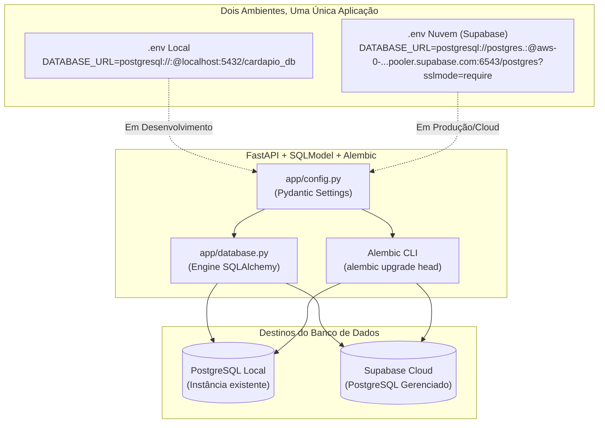

# Plano Didático: PostgreSQL (Local & Supabase), Migrações com Alembic e Configurações (.env)

## Visão Geral do Projeto Didático
Evoluiremos a camada de dados da aplicação para suportar um fluxo profissional de banco de dados relacional:
1. **Banco de Dados PostgreSQL**:
   - **Ambiente Local:** Utilização da instância PostgreSQL já existente na máquina, criando apenas o banco específico da aplicação (ex: `cardapio_db`).
   - **Ambiente Cloud (Nuvem):** Preparado para deploy no **Supabase** (PostgreSQL gerenciado na nuvem).
2. **Twelve-Factor App (Fator III: Configurações no Ambiente)**:
   - Centralização de credenciais em `.env` lido via `pydantic-settings`.
   - **Zero senhas no código ou no Git:** Arquivo `.env` ignorado no `.gitignore` e template explicativo em `.env.example`.
   - Troca de ambiente (Local $\rightarrow$ Supabase) alterando **apenas 1 variável** (`DATABASE_URL`), sem alterar uma linha de código Python.
3. **Versionamento e Migrações de Banco com Alembic**:
   - Substituição de `create_all()` pelo controle de versões do Alembic.
   - Demonstração prática para os alunos:
     - **Migração Inicial:** Criação da tabela `itens_cardapio`.
     - **Evolução de Esquema:** Adição do atributo `tempo_preparo_minutos`.
     - **Rollback:** Reversão controlada (`alembic downgrade -1`).

---

## Diagrama dos Ambientes (Local vs. Nuvem)



---

## User Review Required

> [!IMPORTANT]
> **Segurança de Credenciais (Sem Senhas Hardcoded)**:
> Nenhuma senha real é armazenada nos arquivos de planejamento, templates ou código. O arquivo `.env` fica restrito à máquina local e será explicitamente bloqueado no `.gitignore`.

> [!NOTE]
> **PostgreSQL Local Existente**:
> Como você já possui uma instância local do PostgreSQL, o passo a passo local envolverá apenas a criação do banco de dados (ex: `CREATE DATABASE cardapio_db;`) e configuração do usuário/senha no `.env`.

> [!TIP]
> **Conexão com Supabase**:
> No Supabase, o PostgreSQL utiliza SSL obrigatório (`sslmode=require`) e connection pooler (porta 6543) ou conexão direta (porta 5432). O template `.env.example` conterá instruções detalhadas para os alunos copiarem a Connection String direto do dashboard do Supabase.

---

## Estrutura de Arquivos Proposta

```text
cardapio-api/
├── .env                        # [NOVO - Ignorado no Git] Credenciais reais da máquina
├── .env.example                # [NOVO - Versionado] Modelo sem senhas (Local, Supabase, SQLite)
├── .gitignore                  # [MODIFICAR] Adicionar proteção contra commit de .env
├── requirements.txt            # [MODIFICAR] Adicionar alembic, psycopg2-binary
├── alembic.ini                 # [NOVO] Configuração mestre do Alembic
├── migrations/                 # [NOVO] Diretório de versionamento do banco
│   ├── env.py                  # Integração com SQLModel.metadata e app.config
│   ├── script.py.mako
│   └── versions/               # Scripts de migração com timestamp/revisão
│       ├── 0001_criacao_inicial.py
│       └── 0002_adiciona_tempo_preparo.py # Demonstração de evolução
├── app/
│   ├── config.py               # [NOVO] Pydantic Settings para leitura do .env
│   ├── database.py             # [MODIFICAR] Engine conectada à DATABASE_URL da config
│   ├── models.py               # [MODIFICAR] Inclusão do novo atributo (tempo_preparo_minutos)
│   └── main.py                 # [MODIFICAR] Inicialização limpa delegando DDL ao Alembic
└── tests/
    └── test_cardapio.py        # Testes automatizados mantidos funcionais
```

---

## Proposed Changes

---

### Componente 1: Segurança e Variáveis de Ambiente (.env)

#### [MODIFY] `.gitignore`
Adicionar proteção rigorosa para evitar vazamento de credenciais:
```gitignore
# Variáveis de Ambiente (Segredos e Senhas)
.env
.env.local
.env.*.local
```

#### [NEW] `.env.example`
Template limpo, didático e sem senhas:
```env
# =====================================================================
# 1. OPÇÃO LOCAL: PostgreSQL já instalado na máquina
# Formato: postgresql://<usuario>:<senha>@<host>:<porta>/<banco>
# =====================================================================
DATABASE_URL=postgresql://<usuario>:<sua_senha>@localhost:5432/cardapio_db

# =====================================================================
# 2. OPÇÃO NUVEM: Supabase (PostgreSQL Gerenciado)
# Copie do Dashboard do Supabase: Settings -> Database -> Connection String (URI)
# =====================================================================
# DATABASE_URL=postgresql://postgres.<project_ref>:<sua_senha>@aws-0-<region>.pooler.supabase.com:6543/postgres?sslmode=require

# =====================================================================
# 3. OPÇÃO FALLBACK DIDÁTICO: SQLite Local (sem servidor)
# =====================================================================
# DATABASE_URL=sqlite:///./cardapio.db

# Configurações Gerais
ENVIRONMENT=development
DEBUG=true
```

#### [NEW] `app/config.py`
Leitura tipada com Pydantic Settings:
```python
from pydantic_settings import BaseSettings, SettingsConfigDict

# =====================================================================
# CONCEITO: Twelve-Factor App (Fator III: Configurações)
# A aplicação lê os valores do arquivo .env ou das variáveis do SO.
# =====================================================================
class Settings(BaseSettings):
    DATABASE_URL: str = "sqlite:///./cardapio.db"  # Fallback seguro caso .env não exista
    ENVIRONMENT: str = "development"
    DEBUG: bool = True
    APP_NAME: str = "Cardápio Digital - IFPI TDS 386"

    model_config = SettingsConfigDict(
        env_file=".env",
        env_file_encoding="utf-8",
        extra="ignore"
    )

settings = Settings()
```

---

### Componente 2: Conexão Flexível com o Banco de Dados

#### [MODIFY] `app/database.py`
Suporta PostgreSQL (local ou Supabase) e SQLite (fallback de testes):
```python
from sqlmodel import SQLModel, create_engine, Session
from app.config import settings

# SQLite necessita de connect_args específico; PostgreSQL não.
connect_args = {}
if settings.DATABASE_URL.startswith("sqlite"):
    connect_args["check_same_thread"] = False

engine = create_engine(
    settings.DATABASE_URL, 
    echo=settings.DEBUG, 
    connect_args=connect_args
)

def obter_sessao():
    """Injeção de dependência para os endpoints."""
    with Session(engine) as sessao:
        yield sessao
```

---

### Componente 3: Migrações com Alembic

#### [NEW] Configuração do Alembic (`alembic.ini` e `migrations/env.py`)
- Em `migrations/env.py`, conectaremos:
  1. `target_metadata = SQLModel.metadata` (para detecção automática dos modelos).
  2. `url = settings.DATABASE_URL` (para que o Alembic execute sempre no mesmo banco definido no `.env`, seja Local ou Supabase).

#### [NEW] Migração 01: `0001_criacao_inicial_itens_cardapio`
- Cria a tabela `itens_cardapio` com os campos fundamentais (`id`, `nome`, `descricao`, `preco`, `categoria`, `disponivel`).

#### [NEW] Migração 02: `0002_adiciona_tempo_preparo`
- Demonstração didática de evolução de esquema solicitada pelo professor:
  - `upgrade()`: Adiciona a coluna `tempo_preparo_minutos` (`Integer`, opcional).
  - `downgrade()`: Remove a coluna `tempo_preparo_minutos`.

---

### Componente 4: Atualização dos Modelos SQLModel

#### [MODIFY] `app/models.py`
Adicionar o novo campo de forma harmoniosa:
```python
class ItemCardapioBase(SQLModel):
    nome: str = Field(min_length=2, max_length=100)
    descricao: str | None = Field(default=None, max_length=255)
    preco: float = Field(gt=0)
    categoria: str = Field(default="Lanches")
    disponivel: bool = Field(default=True)
    # Novo atributo adicionado na migração 02:
    tempo_preparo_minutos: int | None = Field(
        default=None, 
        ge=1, 
        description="Tempo estimado de preparo em minutos (ex: 15, 30)"
    )
```

---

## Roteiro Prático de Execução para os Alunos

### Passo 1: Criar o banco de dados no PostgreSQL Local
No terminal (ou via DBeaver / pgAdmin / psql):
```sql
CREATE DATABASE cardapio_db;
```

### Passo 2: Criar o arquivo `.env`
Copiar o modelo e preencher suas credenciais locais:
```bash
cp .env.example .env
```
Editar o `.env`:
```env
DATABASE_URL=postgresql://<seu_usuario>:<sua_senha>@localhost:5432/cardapio_db
```

### Passo 3: Executar as migrações (criar tabelas no PostgreSQL)
```bash
alembic upgrade head
```

### Passo 4: Testar o Rollback (Desfazer última alteração)
```bash
alembic downgrade -1
```
Reaplicar para ficar na versão mais recente:
```bash
alembic upgrade head
```

### Passo 5: No momento do Deploy para a Nuvem (Supabase)
1. Criar um projeto gratuito no [Supabase](https://supabase.com).
2. Obter a Connection String em **Settings $\rightarrow$ Database**.
3. Atualizar a variável `DATABASE_URL` no ambiente da nuvem.
4. Executar `alembic upgrade head` apontando para o Supabase!

---

## Plano de Verificação

### 1. Verificação de Dependências
- Instalar `alembic` e `psycopg2-binary` no ambiente virtual `.venv`.
- Atualizar `requirements.txt`.

### 2. Validação da Leitura de Variáveis (.env)
- Confirmar que `app.config.settings.DATABASE_URL` lê corretamente o arquivo `.env`.

### 3. Validação das Migrações com Alembic
- Rodar `alembic upgrade head`.
- Rodar `alembic history --verbose`.
- Rodar `alembic downgrade -1` e `alembic upgrade head`.

### 4. Testes Automatizados
- Rodar `pytest -v` garantindo que os testes continuam passando.
