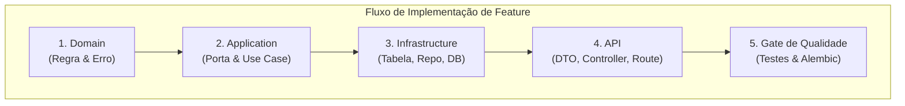
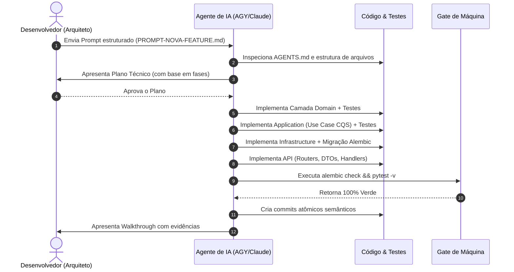

# 📖 PLAYBOOK.md — Guia Operacional de Evolução de Software
**Projeto:** Cardápio Digital (IFPI TDS 386)  
**Arquitetura:** Hexagonal (Ports & Adapters) + Casos de Uso CQS com método único `execute()`

Este documento estabelece o **Playbook definitivo** para a rotina diária de desenvolvimento e evolução contínua da aplicação. Ele contempla duas abordagens operacionais complementares:
1. **Modo Manual:** Passo a passo prático para o desenvolvedor tradicional.
2. **Modo Agente de IA:** Como operar ferramentas autônomas (**AGY**, **Claude Code**, **Codex**) para obter velocidade com máxima conformidade arquitetural.

---

## 🧭 Visão Geral do Ciclo de Vida de uma Mudança

Independentemente do executor (humano ou IA), toda modificação no software obedece ao fluxo rigoroso de camadas da Arquitetura Hexagonal:



---

## 🛠️ PARTE 1: Modo Manual (Desenvolvedor Humano)

### 1. Preparação do Ambiente e Nova Branch
Antes de tocar em qualquer código, garanta que a branch base está sincronizada e crie uma branch semântica:

```bash
# 1. Ativar o ambiente virtual
source .venv/bin/activate

# 2. Atualizar branch principal
git checkout main
git pull origin main

# 3. Criar branch para a nova funcionalidade
git checkout -b feat/nome-da-funcionalidade
```

---

### 2. Levantando a Aplicação e Ferramentas Locais
Para acompanhar o comportamento visual e interativo durante o desenvolvimento:

```bash
# Iniciar o servidor local com reload automático
uvicorn main:app --reload --port 8000
```
- **API REST & Swagger Interativo:** [http://127.0.0.1:8000/docs](http://127.0.0.1:8000/docs)
- **Frontend Reativo Integrado:** [http://127.0.0.1:8000/frontend/](http://127.0.0.1:8000/frontend/)

---

### 3. Implementando uma Nova Funcionalidade (Camada a Camada)

#### Passo 3.1: Camada de Domínio (`app/domain/`)
1. Adicione ou modifique a entidade pura em `app/domain/cardapio.py` (métodos de cálculo, validações de invariantes).
2. Se a regra de negócio puder ser violada, crie a exceção em `app/domain/errors.py` herdando de `ErroDominio` e definindo `codigo = "NOVO_CODIGO_SEMANTICO"`.
3. Escreva o teste unitário de domínio em `tests/test_domain.py`.
4. **Regra de ouro:** **Zero imports** de `fastapi`, `sqlmodel`, `sqlalchemy` ou bibliotecas externas.

#### Passo 3.2: Camada de Aplicação (`app/application/`)
1. Caso a operação exija uma nova operação de persistência, atualize a porta `CardapioRepository` em `app/application/ports/cardapio_repository.py`.
2. Crie uma classe isolada para a intenção do usuário em `app/application/use_cases/nome_do_caso_de_uso.py`.
3. Adicione estritamente o `__init__(self, repository: CardapioRepository)` e o método assíncrono `async def execute(self, ...)`.
4. Exporte o caso de uso em `app/application/use_cases/__init__.py`.
5. Escreva testes unitários com o `FakeCardapioRepository` em `tests/test_use_cases.py`.

#### Passo 3.3: Camada de Infraestrutura e Banco de Dados (`app/infrastructure/`)
1. Se a nova feature exigir colunas no banco:
   - Atualize `app/infrastructure/repositories/sqlmodel_models.py` na classe `ItemCardapioTable`.
2. Se a porta `CardapioRepository` ganhou novo método, implemente-o em `app/infrastructure/repositories/sqlmodel_cardapio_repository.py`.
3. Teste o repositório em `tests/test_infrastructure_repository.py`.

#### Passo 3.4: Evolução do Banco de Dados com Migrações (Alembic)
Sempre que alterar `sqlmodel_models.py`:

```bash
# 1. Gerar arquivo de migração versionada
alembic revision --autogenerate -m "adiciona_campo_x_em_itens_cardapio"

# 2. Inspecionar manualmente o script gerado em migrations/versions/
# Verifique se o upgrade() e downgrade() contêm apenas o que foi alterado.

# 3. Aplicar a migração no banco de dados local
alembic upgrade head

# 4. Verificar se os modelos estão 100% sincronizados com o banco
alembic check
```

#### Passo 3.5: Camada de API / Adaptadores de Entrada (`app/api/`)
1. Defina os schemas Pydantic de entrada/saída em `app/api/schemas/cardapio_schemas.py`.
2. Se criou uma nova exceção de domínio, mapeie seu `codigo` para o status HTTP no `MAPA_ERRO_STATUS` em `app/api/exception_handlers.py`.
3. Registre a função provedora do novo caso de uso em `app/api/dependencies.py` usando `fastapi.Depends`.
4. Adicione a rota no APIRouter em `app/api/routers/cardapio_router.py`, injetando o caso de uso e retornando o schema de resposta.

---

### 4. Gate de Qualidade Obrigatório (Antes de Commitar)

Execute a suíte completa de testes para garantir que nada quebrou:

```bash
# Executar todos os testes automatizados
pytest -v

# Validar sincronismo de schema de banco
DATABASE_URL="sqlite:///./cardapio.db" alembic check
```

Se tiver linters configurados:
```bash
ruff check app tests && mypy app && pytest -v
```

---

### 5. Registro no Git e Abertura de Pull Request no GitHub

Siga o padrão **Conventional Commits** para manter o histórico auditável:

```bash
# 1. Verificar arquivos alterados
git status

# 2. Adicionar modificações de forma atômica
git add app/ tests/ migrations/

# 3. Criar commit descritivo
git commit -m "feat(cardapio): adiciona suporte a cupom de desconto promocional"

# 4. Enviar para o repositório remoto no GitHub
git push -u origin feat/nome-da-funcionalidade
```

#### Template de Pull Request no GitHub:
```markdown
## 📌 O que foi feito
- Adicionada regra de aplicação de desconto na entidade `ItemCardapio`.
- Criado caso de uso `AplicarDescontoUseCase` com método único `execute()`.
- Migração Alembic `0003_adiciona_desconto` aplicada e verificada.
- Endpoint `PATCH /cardapio/{id}/desconto` exposto com schema `AplicarDescontoRequest`.

## 🧪 Como foi validado
- Testes unitários em `test_domain.py` e `test_use_cases.py`.
- Testes de integração na API em `test_cardapio_api.py`.
- Gate local: `pytest -v` verde (51+ testes).
- Verificação do Alembic: `alembic check` verde.
```

---

## 🤖 PARTE 2: Modo Agente de IA (AGY, Claude Code, Codex)

Na era dos agentes autônomos, o desenvolvedor atua como **Arquiteto e Revisor Crítico**. A Arquitetura Hexagonal deste repositório foi construída especificamente para maximizar a autonomia e precisão dos agentes.

### 1. Protocolo de Delegação: O Prompt Perfeito
Ao solicitar que um agente desenvolva uma nova funcionalidade, utilize sempre a estrutura padronizada contida em [`PROMPT-NOVA-FEATURE.md`](file:///Users/rogerio410/ifpi-tds-386-2026.2-backend/cardapio-api/PROMPT-NOVA-FEATURE.md).

#### Exemplo de Comando para o Agente:
```markdown
/plan agy Goal
Implementar funcionalidade de "Tempo Estimado de Espera em Fila":
[Descrever objetivo com base no template de PROMPT-NOVA-FEATURE.md]

Context:
- Leia AGENTS.md e PLANO-REFATORACAO-HEXAGONAL.md antes de propor qualquer código.
- Mantenha a pureza do domínio em app/domain/.
- O caso de uso DEVE ter classe própria com único método assíncrono execute().
- Erros devem herdar de ErroDominio com atributo semântico codigo: str.

Constraints:
- Nenhum endpoint existente pode ter payload alterado.
- Adicione testes unitários e de integração antes de dar como concluído.
- Finalize com gate verde: alembic check e pytest -v.
```

---

### 2. Ciclo de Trabalho Autônomo do Agente

O agente de IA segue este fluxo determinístico:



---

### 3. O Que o Desenvolvedor Deve Inspecionar (Code Review do Agente)

Mesmo com testes verdes, o desenvolvedor humano deve realizar uma inspeção pontual nas seguintes fronteiras:

| O Que Verificar | Onde Olhar | Critério de Aceite |
| :--- | :--- | :--- |
| **Pureza do Domínio** | `app/domain/` | Zero imports de `fastapi`, `sqlmodel`, `sqlalchemy` ou `requests`. |
| **Invariante CQS** | `app/application/use_cases/` | Cada classe possui apenas `__init__` e `async def execute(...)`. Proibido métodos auxiliares públicos. |
| **Erros Semânticos** | `app/domain/errors.py` | Exceções herdam de `ErroDominio` com `codigo: str` em UPPER_SNAKE_CASE. |
| **Sem `isinstance`** | `app/api/exception_handlers.py` | Mapeamento no `MAPA_ERRO_STATUS`. Sem blocos `if isinstance(e, ...)`. |
| **Compatibilidade de Erro** | Resposta HTTP | A chave `"detail"` deve estar sempre presente no payload de erro. |
| **Migrações Limpas** | `migrations/versions/` | O script do Alembic não removeu colunas ou índices indevidos acidentalmente. |

---

## ⚡ Tabela Comparativa de Ações: Manual vs Agente de IA

| Ação | Desenvolvedor Humano (Manual) | Agente de IA (AGY / Claude Code) |
| :--- | :--- | :--- |
| **Planejamento da Feature** | Esboça mentalmente ou em notas as classes e arquivos afetados. | Utiliza `/plan` para gerar plano fatiado e árvore de dependências. |
| **Criação do Domínio** | Codifica a dataclass e exceptions manualmente. | Gera a entidade, métodos de domínio e regras com tipagem estrita. |
| **Criação do Caso de Uso** | Cria arquivo isolado com `async def execute()`. | Cria caso de uso CQS e gera mock/fake em `test_use_cases.py`. |
| **Evolução do Banco (DDL)** | Edita modelo e roda `alembic revision --autogenerate`. | Edita modelo em `infrastructure`, gera migração e roda `alembic check`. |
| **Criação da Rota** | Atualiza schemas Pydantic e adiciona endpoint no APIRouter com Depends. | Cria DTOs, injeta dependência via `Depends` e conecta ao router. |
| **Validação** | Roda testes manualmente no terminal (`pytest -v`). | Executa suíte de testes de máquina e corrige regressões autonomamente. |
| **Controle de Versão** | Faz `git add`, escreve mensagem de commit e faz push. | Cria marcos semânticos com Conventional Commits para cada fase. |

---

## 🎯 Resumo Rápido de Comandos

```bash
# Iniciar Servidor
uvicorn main:app --reload --port 8000

# Executar Testes
pytest -v

# Migrações de Banco (Alembic)
alembic revision --autogenerate -m "descricao"
alembic upgrade head
DATABASE_URL="sqlite:///./cardapio.db" alembic check

# Gate Completo de Qualidade
DATABASE_URL="sqlite:///./cardapio.db" alembic check && pytest -v
```
