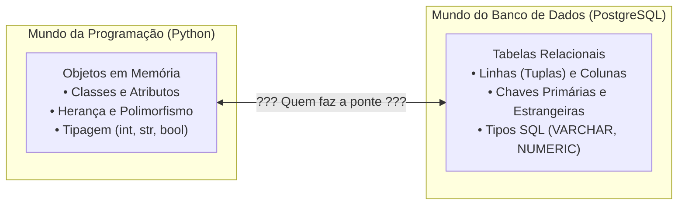
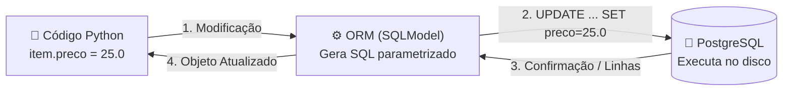
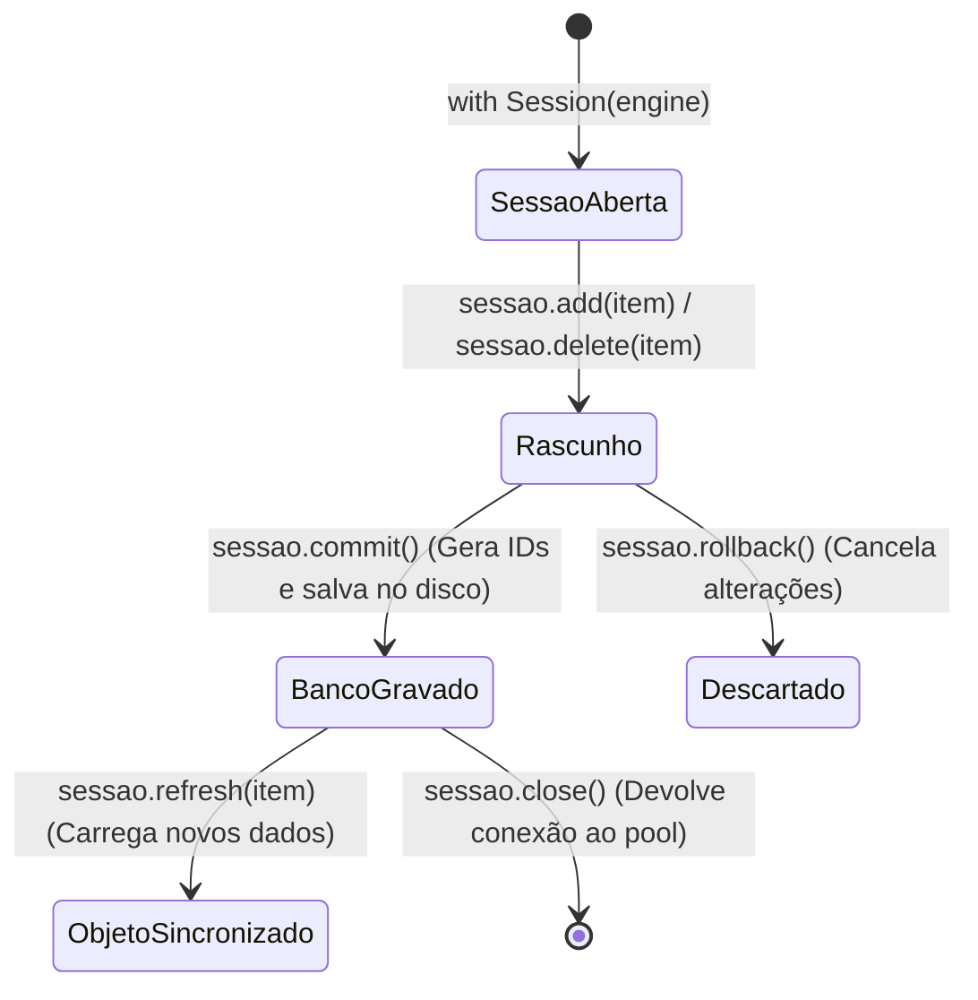

<!-- Slide 01: Capa -->
# 🗄️ Do SQL Puro ao SQLModel
## O Que os ORMs Resolvem e Como Operar Bancos de Dados no Backend Moderno

**Curso:** Técnico em Desenvolvimento de Sistemas (IFPI TDS 386)  
**Disciplina:** Desenvolvimento Backend (2026.2)  
**Professor:** Rogério Silva  
**Foco da Aula:** Descompasso Objeto-Relacional • Sessão • SQL Puro vs SQLModel Lado a Lado • DDL & Migrações

---

<!-- Slide 02: Objetivos de Aprendizagem -->
## 🎯 Objetivos de Aprendizagem & Roteiro

Nesta aula, conectaremos o seu conhecimento prévio de **bancos de dados relacionais e SQL** com a programação backend moderna em Python:

1. **Compreender o "Descompasso Objeto-Relacional":** Por que ligar código orientado a objetos a tabelas relacionais sempre foi um desafio na computação.
2. **Entender o papel dos ORMs:** Por que eles surgiram e por que **o SQL continua vivo e central**.
3. **Dominar o conceito de Sessão (*Session / Unit of Work*):** O que são transações, `commit()`, `refresh()` e `rollback()`.
4. **Praticar o Comparativo Lado a Lado:** Analisar cada operação de CRUD vendo exatamente como você escrevia em SQL puro e como fazemos no SQLModel.
5. **Diferenciar DDL inicial de Migrações:** Por que `create_all()` não basta e como o Alembic protege seu banco em produção.

---

<!-- Slide 03: Dois Mundos Distintos -->
## 🌍 Dois Mundos Distintos: Relacional vs Objetos

Quando criamos uma aplicação web completa, dois paradigmas coexistem:



- No Python, pensamos em instâncias: `item.nome = 'Filé com Fritas'`.
- No banco de dados, pensamos em registros tabulares: `INSERT INTO itens_cardapio VALUES (...)`.

---

<!-- Slide 04: O Que é a Incompatibilidade de Impedância? -->
## ⚡ O Que é o *Object-Relational Impedance Mismatch*?

Na engenharia de software, essa diferença conceitual é chamada de **Descompasso de Impedância Objeto-Relacional**:

| Conceito em Orientação a Objetos | Conceito no Modelo Relacional | O Problema da Conversão |
| :--- | :--- | :--- |
| **Instâncias / Objetos** | **Linhas de uma Tabela** | Como transformar um `dict`/classe em linhas SQL? |
| **Identidade de Objeto (`id(obj)`)** | **Chave Primária (`id PRIMARY KEY`)** | Objetos têm endereço de memória; bancos usam chaves. |
| **Herança de Classes** | **Não existe herança nativa** | Bancos relacionais não herdam tabelas diretamente. |
| **Tipos de Dados** | **Tipos SQL do SGBD** | `datetime` do Python vs `TIMESTAMP WITH TIME ZONE`. |

<div class="box">
💡 <b>A pergunta que motivou a indústria:</b> <i>"Podemos evitar que o programador gaste 60% do seu tempo escrevendo código repetitivo para converter linhas de SQL em objetos Python?"</i>
</div>

---

<!-- Slide 05: A Vida sem ORM: O Pesadelo das Strings SQL -->
## 🦕 A Vida sem ORM: O Pesadelo Manual

Antes dos ORMs, programadores precisavam abrir cursores e concatenar strings na mão:

```python
# ❌ CÓDIGO LEGADO (Antigo e Arriscado):
cursor = conexao.cursor()
sql = f"SELECT * FROM itens_cardapio WHERE categoria = '{categoria_digitada}'"
cursor.execute(sql)
linhas = cursor.fetchall()

# Mapeamento manual exaustivo linha por linha:
pratos = []
for l in linhas:
    pratos.append({"id": l[0], "nome": l[1], "preco": l[2], "categoria": l[3]})
```

### O que havia de errado com isso?
1. **Quebrava facilmente:** Se mudasse a ordem das colunas no banco, `l[2]` virava texto e o código quebrava!
2. **Sem Autocomplete:** O editor não sabia quais propriedades o prato tinha.
3. **Vulnerabilidade Fatal de SQL Injection:** Concatenação direta permitia que invasores enviassem `' OR '1'='1` e apagassem a base de dados!

---

<!-- Slide 06: O Que é um ORM? A Analogia do Intérprete -->
## 🤝 O Que é um ORM? A Analogia do Intérprete

<div class="analogy">
<h3>🗣️ O ORM é como um Tradutor / Intérprete Diplomático Bilíngue:</h3>
<ul>
  <li>O seu código Python fala fluentemente <b>Classes, Atributos e Métodos</b>.</li>
  <li>O seu banco de dados PostgreSQL só fala e entende <b>SQL nativo (ANSI SQL)</b>.</li>
  <li>O <b>ORM (Object-Relational Mapping)</b> fica no meio do caminho:
    <ol>
      <li>Lê o comando que você deu em Python.</li>
      <li>Traduz para um <code>SELECT</code>, <code>INSERT</code> ou <code>UPDATE</code> perfeitamente otimizado.</li>
      <li>Envia ao banco, recebe o resultado tabular e transforma de volta em objetos Python tipados!</li>
    </ol>
  </li>
</ul>
</div>



---

<!-- Slide 07: Mito vs Realidade: O SQL Morreu? -->
## 🛑 Mito vs Realidade: O SQL Morreu?

<div class="alert">
<h3>⚠️ MITO COMUM DE ALUNOS:</h3>
<p><i>"Agora que usamos SQLModel/ORM, não preciso mais saber SQL!"</i></p>
</div>

### A Grande Verdade da Engenharia de Software:
- **O SQL NÃO morreu e NUNCA foi substituído!**
- O motor do banco de dados (PostgreSQL, MySQL, SQLite, Oracle) **não sabe o que é Python**. Ele só sabe compilar e executar **instruções SQL**!
- O que o ORM faz é **escrever o SQL por você** nas tarefas rotineiras do dia a dia.
- **Saber SQL é o que diferencia o programador sênior:** Quando uma consulta fica lenta ou envolve relatórios analíticos complexos com agregações pesadas, você precisa inspecionar o SQL real para otimizar índices e planos de execução!

---

<!-- Slide 08: O Surgimento do SQLModel -->
## 💡 O Surgimento do SQLModel

No ecossistema Python moderno, tínhamos dois gigantes:
1. **SQLAlchemy:** O ORM mais robusto, seguro e maduro do mercado.
2. **Pydantic:** A melhor biblioteca de validação de dados e conversão de tipos (usada pelo FastAPI).

### O Problema da Duplicação:
Até 2021, precisávamos declarar os modelos **duas vezes**: uma classe para a tabela do SQLAlchemy e outra para o schema de validação do Pydantic.

### A Chegada do SQLModel:
Criado por **Sebastián Ramírez**, o **SQLModel** combina o SQLAlchemy 2.0 e o Pydantic em uma única sintaxe elegante baseada em Type Hints nativos do Python!

---

<!-- Slide 09: Anatomia do Modelo no Projeto -->
## 🧬 Anatomia do Modelo no Projeto (`app/models.py`)

Veja como unificamos tabela e validação em uma só definição:

```python
from sqlmodel import SQLModel, Field

# 1. Base Compartilhada: Usada tanto na API quanto no Banco
class ItemCardapioBase(SQLModel):
    nome: str = Field(min_length=2, max_length=100) # Validação Pydantic
    descricao: str | None = None
    preco: float = Field(gt=0)                      # Regra: Preço > 0
    categoria: str = "Lanches"
    disponivel: bool = True
    tempo_preparo_minutos: int | None = None

# 2. Tabela Real do Banco: Herda a base e ativa table=True
class ItemCardapio(ItemCardapioBase, table=True):
    __tablename__ = "itens_cardapio" # Nome da tabela no PostgreSQL

    id: int | None = Field(default=None, primary_key=True)
```

<div class="box">
⭐ <b>Repare:</b> O mesmo campo <code>nome</code> serve como coluna <code>VARCHAR(100)</code> no banco e como validador de payload no Swagger!
</div>

---

<!-- Slide 10: O Conceito de Sessão -->
## 🛒 O Conceito de Sessão (*Session / Unit of Work*)

Antes de vermos as operações, precisamos entender: **O que é a `Session`?**

<div class="analogy">
<h3>📝 Analogia da Prancheta / Carrinho de Compras:</h3>
<ul>
  <li>Imagine que você vai ao supermercado com um <b>carrinho de compras</b>.</li>
  <li>Você coloca itens no carrinho (<code>sessao.add(...)</code>).</li>
  <li>Você remove itens do carrinho (<code>sessao.delete(...)</code>).</li>
  <li><b>Importante:</b> Nada foi comprado ainda! Tudo está na sua posse provisória na memória.</li>
  <li>A compra só acontece de verdade quando você passa no caixa e paga: <b><code>sessao.commit()</code></b>!</li>
  <li>Se você desistir antes de pagar, basta largar o carrinho: <b><code>sessao.rollback()</code></b> (nada é salvo no banco).</li>
</ul>
</div>

<div class="box">
💡 Na computação, esse padrão chama-se <b>Unit of Work (Unidade de Trabalho)</b>. Ele agrupa várias alterações em uma única transação atômica (tudo grava ou nada grava).
</div>

---

<!-- Slide 11: O Ciclo de Vida da Sessão -->
## 🔄 O Ciclo de Vida da Sessão



- **`add(item)`:** Registra que o objeto deve ser salvo na próxima oportunidade.
- **`commit()`:** Executa a transação real no PostgreSQL (`BEGIN ... COMMIT;`).
- **`refresh(item)`:** Recarrega o objeto com os valores reais que o banco gerou (ex: o `id` autoincrementado).
- **`rollback()`:** Desfaz quaisquer comandos pendentes da transação em caso de erro.

---

<!-- Slide 12: Injeção de Dependência no FastAPI -->
## 💉 Injeção de Dependência da Sessão (`Depends`)

Como garantimos que cada requisição do cliente receba uma sessão limpa e **sempre a feche** ao final?

```python
# app/database.py
def obter_sessao():
    with Session(engine) as sessao:
        yield sessao  # Entrega a sessão para o endpoint
    # Ao sair do bloco 'with', sessao.close() é chamado AUTOMATICAMENTE!
```

E no router do cardápio:
```python
# app/routers/cardapio.py
@router.get("/")
def listar(sessao: Session = Depends(obter_sessao)):
    # sessao pronta para uso, injetada pelo FastAPI!
    ...
```

<div class="box">
🔒 <b>Segurança contra vazamento:</b> Se a rota disparar um erro 500 no meio do caminho, o Python encerra o gerador e fecha a conexão com o banco com segurança!
</div>

---

<!-- Slide 13: Comparativo 1 - Inserir Registro -->
## ⚔️ Duelo 01: Inserir Registro (Create)

### O Objetivo:
Cadastrar um novo prato no cardápio e obter seu ID gerado automaticamente.

| Como você faria em SQL Puro | Como fazemos no SQLModel (`app/routers/cardapio.py`) |
| :--- | :--- |
| ```sql<br>INSERT INTO itens_cardapio <br>  (nome, preco, categoria, disponivel) <br>VALUES <br>  ('Pastel de Coalho', 18.00, 'Lanches', true)<br>RETURNING id;<br>``` | ```python<br>novo = ItemCardapio(<br>    nome="Pastel de Coalho",<br>    preco=18.00,<br>    categoria="Lanches",<br>    disponivel=True<br>)<br>sessao.add(novo)<br>sessao.commit()<br>sessao.refresh(novo) # novo.id já preenchido!<br>``` |

<div class="box">
💡 <b>O Ganho:</b> Você não precisa escrever strings SQL concatenadas nem mapear os tipos de dados. O Python faz o bind dos parâmetros automaticamente!
</div>

---

<!-- Slide 14: Comparativo 2 - Listar Todos -->
## ⚔️ Duelo 02: Listar Todos os Registros (Read All)

### O Objetivo:
Recuperar a lista de todos os pratos cadastrados no cardápio.

| Como você faria em SQL Puro | Como fazemos no SQLModel |
| :--- | :--- |
| ```sql<br>SELECT <br>  id, nome, descricao, preco, <br>  categoria, disponivel, tempo_preparo_minutos <br>FROM itens_cardapio;<br>``` | ```python<br># 1. Constrói a declaração de seleção<br>instrucao = select(ItemCardapio)<br><br># 2. Executa na sessão e extrai todos<br>pratos = sessao.exec(instrucao).all()<br>``` |

<div class="box">
⭐ <b>Retorno Inteligente:</b> Em vez de uma matriz bruta de strings e números (<code>[(1, 'Filé', ...)]</code>), <code>pratos</code> é uma lista de objetos Python com autocompletar completo no VS Code (<code>pratos[0].nome</code>, <code>pratos[0].preco</code>).
</div>

---

<!-- Slide 15: Comparativo 3 - Buscar por Chave Primária (ID) -->
## ⚔️ Duelo 03: Buscar por ID (Read by PK)

### O Objetivo:
Buscar com eficiência máxima um único prato a partir do seu `id`.

| Como você faria em SQL Puro | Como fazemos no SQLModel |
| :--- | :--- |
| ```sql<br>SELECT * <br>FROM itens_cardapio <br>WHERE id = 15 <br>LIMIT 1;<br>``` | ```python<br># Atalho ultra-rápido para chave primária:<br>item = sessao.get(ItemCardapio, 15)<br><br>if not item:<br>    raise HTTPException(status_code=404)<br>``` |

<div class="analogy">
⚡ <b>Otimização de Cache:</b> O método <code>sessao.get()</code> verifica primeiro se o objeto de ID 15 já não está na memória da sessão atual. Se estiver, ele nem precisa ir ao PostgreSQL de novo!
</div>

---

<!-- Slide 16: Comparativo 4 - Filtrar por Valor Exato -->
## ⚔️ Duelo 04: Filtro por Valor Exato (`WHERE`)

### O Objetivo:
Trazer apenas os pratos que pertencem à categoria "Bebidas".

| Como você faria em SQL Puro | Como fazemos no SQLModel |
| :--- | :--- |
| ```sql<br>SELECT * <br>FROM itens_cardapio <br>WHERE categoria = 'Bebidas';<br>``` | ```python<br>instrucao = (<br>    select(ItemCardapio)<br>    .where(ItemCardapio.categoria == "Bebidas")<br>)<br>bebidas = sessao.exec(instrucao).all()<br>``` |

<div class="box">
💡 <b>A Mágica do Operador <code>==</code>:</b> O SQLModel sobrecarrega o operador de igualdade do Python para que <code>ItemCardapio.categoria == "Bebidas"</code> não retorne um booleano simples, mas sim uma cláusula SQL <code>BinaryExpression</code>!
</div>

---

<!-- Slide 17: Comparativo 5 - Filtros Combinados e Comparações -->
## ⚔️ Duelo 05: Múltiplos Filtros e Comparações Numéricas

### O Objetivo:
Buscar itens disponíveis que custem no máximo R$ 25,00.

| Como você faria em SQL Puro | Como fazemos no SQLModel |
| :--- | :--- |
| ```sql<br>SELECT * <br>FROM itens_cardapio <br>WHERE preco <= 25.00 <br>  AND disponivel = true;<br>``` | ```python<br>instrucao = (<br>    select(ItemCardapio)<br>    .where(ItemCardapio.preco <= 25.00)<br>    .where(ItemCardapio.disponivel == True)<br>)<br>economicos = sessao.exec(instrucao).all()<br>``` |

<div class="box">
⭐ <b>Composição Dinâmica:</b> Você pode encadear múltiplos <code>.where()</code> condicionalmente (usando <code>if preco_maximo: instrucao = instrucao.where(...)</code>) sem risco de errar vírgulas ou palavras-chave <code>AND</code> do SQL!
</div>

---

<!-- Slide 18: Comparativo 6 - Busca Textual Parcial -->
## ⚔️ Duelo 06: Busca Textual Parcial (`ILIKE`)

### O Objetivo:
Encontrar pratos que contenham a palavra "carne" no nome, ignorando maiúsculas/minúsculas.

| Como você faria em SQL Puro (PostgreSQL) | Como fazemos no SQLModel |
| :--- | :--- |
| ```sql<br>SELECT * <br>FROM itens_cardapio <br>WHERE nome ILIKE '%carne%';<br>``` | ```python<br>termo = "carne"<br>instrucao = (<br>    select(ItemCardapio)<br>    .where(ItemCardapio.nome.ilike(f"%{termo}%"))<br>)<br>resultado = sessao.exec(instrucao).all()<br>``` |

<div class="box">
💡 <b>Compatibilidade:</b> O método <code>.ilike()</code> do SQLModel traduz automaticamente para <code>ILIKE</code> no PostgreSQL ou para <code>LIKE LOWER(...)</code> em bancos que não possuem suporte nativo ao operador!
</div>

---

<!-- Slide 19: Comparativo 7 - Ordenação e Paginação -->
## ⚔️ Duelo 07: Ordenação e Paginação (`ORDER BY`, `LIMIT`)

### O Objetivo:
Listar os 5 pratos mais caros do cardápio em ordem decrescente.

| Como você faria em SQL Puro | Como fazemos no SQLModel |
| :--- | :--- |
| ```sql<br>SELECT * <br>FROM itens_cardapio <br>ORDER BY preco DESC <br>LIMIT 5 OFFSET 0;<br>``` | ```python<br>instrucao = (<br>    select(ItemCardapio)<br>    .order_by(ItemCardapio.preco.desc())<br>    .limit(5)<br>    .offset(0)<br>)<br>mais_caros = sessao.exec(instrucao).all()<br>``` |

<div class="box">
⭐ <b>Paginação na API:</b> Com <code>.limit(tamanho_pagina)</code> e <code>.offset((pagina - 1) * tamanho_pagina)</code>, implementar paginação profissional no FastAPI leva apenas 2 linhas de código!
</div>

---

<!-- Slide 20: Comparativo 8 - Atualização de Registro -->
## ⚔️ Duelo 08: Atualização de Registro (Update)

### O Objetivo:
Alterar o preço e a disponibilidade do prato com ID 10.

| Como você faria em SQL Puro | Como fazemos no SQLModel |
| :--- | :--- |
| ```sql<br>UPDATE itens_cardapio <br>SET preco = 42.00, disponivel = false <br>WHERE id = 10;<br>``` | ```python<br># 1. Recupera o objeto do banco<br>item = sessao.get(ItemCardapio, 10)<br><br># 2. Modifica diretamente seus atributos!<br>item.preco = 42.00<br>item.disponivel = False<br><br># 3. Salva definitivamente<br>sessao.commit()<br>``` |

<div class="analogy">
✨ <b>Padrão "Dirty Checking":</b> O ORM monitora quais atributos do objeto você alterou. Ao chamar <code>sessao.commit()</code>, ele gera o comando <code>UPDATE</code> alterando <b>apenas</b> as colunas modificadas!
</div>

---

<!-- Slide 21: Comparativo 9 - Atualização Parcial Dinâmica -->
## ⚔️ Duelo 09: Atualização Parcial Dinâmica (PATCH / PUT)

### O Problema:
O usuário enviou no JSON apenas o campo que ele quer mudar (ex: só o preço, sem reenviar o nome):

```python
# app/routers/cardapio.py
@router.put("/{item_id}")
def atualizar_item(item_id: int, dados: ItemCardapioUpdate, sessao: Session = Depends(obter_sessao)):
    item = sessao.get(ItemCardapio, item_id)
    if not item: raise HTTPException(404)

    # exclude_unset=True extrai APENAS os campos enviados na requisição atual:
    dados_recebidos = dados.model_dump(exclude_unset=True)

    # Aplica dinamicamente nos atributos do objeto:
    for campo, valor in dados_recebidos.items():
        setattr(item, campo, valor)

    sessao.commit()
    return item
```

<div class="box">
💡 <b>Sem SQL Frágil:</b> Fazer isso em SQL puro exigiria montar strings complexas concatenando vírgulas (<code>UPDATE ... SET nome = ?, preco = ?</code>). No SQLModel, é automático e seguro!
</div>

---

<!-- Slide 22: Comparativo 10 - Exclusão de Registro -->
## ⚔️ Duelo 10: Exclusão de Registro (Delete)

### O Objetivo:
Remover definitivamente o prato com ID 10 do cardápio.

| Como você faria em SQL Puro | Como fazemos no SQLModel |
| :--- | :--- |
| ```sql<br>DELETE FROM itens_cardapio <br>WHERE id = 10;<br>``` | ```python<br># 1. Busca o item<br>item = sessao.get(ItemCardapio, 10)<br>if not item:<br>    raise HTTPException(status_code=404)<br><br># 2. Marca para exclusão e confirma<br>sessao.delete(item)<br>sessao.commit()<br>``` |

<div class="box">
⭐ <b>Semântica REST:</b> Se o item não existir, retornamos <code>404 Not Found</code>. Se excluído com sucesso, o FastAPI devolve <code>204 No Content</code> sem corpo de resposta.
</div>

---

<!-- Slide 23: Inspecionando os Bastidores do SQLModel -->
## 🔍 Inspecionando os Bastidores: O Que Roda de Verdade?

O que acontece quando você roda `sessao.exec(select(ItemCardapio).where(ItemCardapio.preco <= 30.0))`?

Se você ativar `echo=True` na engine (`app/database.py`), verá no terminal o log real emitido pelo SQLAlchemy:

```text
INFO sqlalchemy.engine.Engine BEGIN (implicit)
INFO sqlalchemy.engine.Engine SELECT 
    itens_cardapio.id, 
    itens_cardapio.nome, 
    itens_cardapio.descricao, 
    itens_cardapio.preco, 
    itens_cardapio.categoria, 
    itens_cardapio.disponivel, 
    itens_cardapio.tempo_preparo_minutos 
FROM itens_cardapio 
WHERE itens_cardapio.preco <= %(preco_1)s
INFO sqlalchemy.engine.Engine [generated in 0.00018s] {'preco_1': 30.0}
```

<div class="box">
🎯 <b>Repare:</b> O ORM gerou o SQL perfeitamente otimizado e substituiu o valor por um parâmetro seguro: <code>%(preco_1)s</code>!
</div>

---

<!-- Slide 24: Prevenção Automática de SQL Injection -->
## 🛡️ Prevenção Automática de SQL Injection

Imagine que um usuário mal-intencionado envie este nome de busca:
```text
' OR 1=1; DROP TABLE itens_cardapio; --
```

### O que aconteceria em código ingênuo com string concatenada:
```sql
-- ❌ O banco executaria duas instruções e destruiria a tabela!
SELECT * FROM itens_cardapio WHERE nome = '' OR 1=1; DROP TABLE itens_cardapio; --';
```

### Como o SQLModel / SQLAlchemy nos protege:
Ele **nunca** junta o valor do usuário na string SQL. Ele utiliza **Prepared Statements (Consultas Pré-compiladas)**:
```sql
SELECT * FROM itens_cardapio WHERE nome = $1;
```
O banco trata a entrada do invasor literalmente como texto inofensivo! A tabela continua 100% segura.

---

<!-- Slide 25: DDL - Criação Inicial de Tabelas -->
## 🏗️ DDL: Criação Inicial de Tabelas

Antes de fazermos CRUD, as tabelas precisam existir no banco de dados:

| Em SQL Puro (DDL Manual) | No SQLModel (`app/database.py`) |
| :--- | :--- |
| ```sql<br>CREATE TABLE IF NOT EXISTS itens_cardapio (<br>  id SERIAL PRIMARY KEY,<br>  nome VARCHAR(100) NOT NULL,<br>  descricao VARCHAR(255),<br>  preco FLOAT NOT NULL,<br>  categoria VARCHAR(50) NOT NULL,<br>  disponivel BOOLEAN NOT NULL,<br>  tempo_preparo_minutos INTEGER<br>);<br>``` | ```python<br># Inspeciona todas as classes herdadas<br># de SQLModel com table=True e cria no banco:<br><br>def criar_tabelas():<br>    SQLModel.metadata.create_all(engine)<br>``` |

<div class="box">
💡 <b>Excelente para Iniciar:</b> O <code>create_all()</code> é perfeito para as primeiras aulas e para suítes de testes automatizados com SQLite em memória!
</div>

---

<!-- Slide 26: O Grande Limite do `create_all()` -->
## ⚠️ O Grande Limite do `create_all()`

Mas o que acontece quando o seu projeto entra em produção e, semanas depois, o cliente pede um campo novo?

```python
# Você adiciona o atributo no models.py:
class ItemCardapioBase(SQLModel):
    ...
    tempo_preparo_minutos: int | None = None # Novo atributo!
```

E roda o servidor novamente com `SQLModel.metadata.create_all(engine)`:
- O `create_all()` executa apenas: `CREATE TABLE IF NOT EXISTS itens_cardapio ...`.
- Como a tabela `itens_cardapio` **já existe**, o banco responde: *"Já tenho essa tabela, obrigado!"* e **não faz absolutamente nada**!
- **Resultado:** A nova coluna `tempo_preparo_minutos` **NÃO é criada**. Quando o endpoint tentar gravar, o sistema quebra em produção!

---

<!-- Slide 27: A Solução Definitiva: Migrações com Alembic -->
## 🔄 A Solução Definitiva: Migrações com Alembic

Em ambientes profissionais e na nuvem (Supabase / PostgreSQL), usamos **Migrações Versionadas**:

| Ação Manual Arriscada | Como Fazemos com Alembic no Projeto |
| :--- | :--- |
| Conectar no banco de produção via terminal e digitar comandos `ALTER TABLE` na mão arriscando corromper a base. | ```bash<br># 1. O Alembic compara o models.py com o banco:<br>alembic revision --autogenerate -m "add_tempo"<br><br># 2. Aplica com segurança registrando a versão:<br>alembic upgrade head<br>``` |

### O SQL Real que o Alembic Executa nos Bastidores:
```sql
ALTER TABLE itens_cardapio ADD COLUMN tempo_preparo_minutos INTEGER;
UPDATE alembic_version SET version_num = '0002_tempo_preparo';
```
Todos os pratos já existentes no restaurante continuam preservados intactos!

---

<!-- Slide 28: Matriz Resumo: SQL Puro vs SQLModel -->
## 📊 Matriz Resumo: SQL Puro vs SQLModel

| Critério de Comparação | SQL Puro / Drivers Básicos | ORM Moderno (SQLModel) |
| :--- | :--- | :--- |
| **Produtividade no Desenvolvimento** | Baixa (muito código repetitivo) | 🟢 **Altíssima** (operações em poucas linhas) |
| **Segurança contra SQL Injection** | Depende do cuidado manual do desenvolvedor | 🟢 **Nativa** (Prepared statements automáticos) |
| **Tipagem & Autocomplete (IDE)** | Nenhuma (retorna tuplas / dicionários crus) | 🟢 **Total** (Type Hints e validação Pydantic) |
| **Portabilidade entre Bancos** | Baixa (SQL varia entre Postgres, SQLite, MySQL) | 🟢 **Alta** (mesmo código roda em qualquer SGBD) |
| **Performance em Queries Analíticas Gigantes** | 🟢 **Máxima** (controle total sobre cada byte) | Média (pode exigir ajustes e queries manuais) |

---

<!-- Slide 29: Quando Usar Cada Abordagem no Mercado? -->
## 🏢 Quando Usar Cada Abordagem no Mercado?

<div class="box">
<h3>🟢 Quando USAR ORMs (SQLModel / SQLAlchemy):</h3>
<ul>
  <li><b>Aplicações Web e APIs REST Tradicionais:</b> 90% das operações do dia a dia (CRUD de usuários, pedidos, produtos).</li>
  <li><b>Validação de Dados de Entrada:</b> Integração perfeita com schemas FastAPI.</li>
  <li><b>Segurança e Agilidade:</b> Equipes que precisam entregar software confiável e manutenível rapidamente.</li>
</ul>
</div>

<div class="alert">
<h3>🔵 Quando USAR SQL Puro ou Query Builders Específicos:</h3>
<ul>
  <li><b>Relatórios Complexos de BI / Data Analytics:</b> Relatórios com 15 <code>JOIN</code>s, <code>GROUP BY</code> complexos e funções de janela (Window Functions).</li>
  <li><b>Processamento em Lote (*Batch Jobs*):</b> Importação de milhões de registros onde cada microssegundo importa.</li>
</ul>
</div>

---

<!-- Slide 30: Conclusão & Desafios de Fixação -->
## 🏆 Conclusão & Desafios de Fixação

### O que aprendemos hoje:
1. O ORM não veio para "substituir" o SQL, mas sim para **automatizar a tradução** entre objetos e tabelas.
2. A **Sessão** gerencia transações com segurança (carrinho de compras $\rightarrow$ `commit()`).
3. O **SQLModel** combina o melhor de dois mundos: modelos de banco e schemas de validação.
4. **Migrações (Alembic)** são indispensáveis para a evolução de sistemas em produção.

### 🚀 Desafios Práticos para Praticar:
- **Desafio 1:** Escreva mentalmente como seria a query SQL da rota com filtro `preco_maximo` criada em `cardapio.py` e compare com a linha `.where(ItemCardapio.preco <= preco_maximo)`.
- **Desafio 2:** Crie um endpoint que liste os itens com `disponivel == False` e calcule o valor total dos pratos esgotados.
- **Desafio 3:** Pratique no terminal o comando `alembic history` para inspecionar todas as versões do seu banco!

---
<!-- Fim da Apresentação -->
