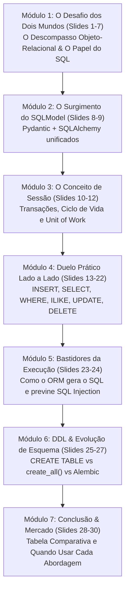

# Plano: Apresentação Didática - Do SQL Puro ao SQLModel (Comparativo Lado a Lado)

## Visão Geral do Material
O objetivo desta apresentação é construir uma ponte didática sólida entre o conhecimento que os alunos do IFPI já possuem de **SQL Relacional** e o uso moderno de **ORMs com SQLModel** no FastAPI.

A aula mostrará:
1. **O Problema Real que os ORMs Resolvem**: O descompasso objeto-relacional (*Object-Relational Impedance Mismatch*), riscos de segurança (SQL Injection) e o excesso de código repetitivo de mapeamento manual.
2. **O Papel Fundamental do SQL**: Deixar claro que o SQL **não foi substituído nem morreu**. O banco de dados relacional só entende SQL! O papel do ORM é agir como um "tradutor/gerador" de SQL seguro e tipado.
3. **O Conceito de Sessão (*Session / Unit of Work*)**: Explicar com analogias o que é uma sessão, como ela gerencia transações, o que fazem `commit()`, `rollback()`, `add()` e `refresh()`.
4. **Duelo Prático Lado a Lado (SQL Puro vs SQLModel)**: Cada operação fundamental de banco de dados (`INSERT`, `SELECT`, `WHERE`, filtros combinados, `ILIKE`, `UPDATE`, `DELETE`) apresentada lado a lado, com o SQL que eles já conhecem de um lado e o código SQLModel do projeto do outro.
5. **Criação de Tabelas e Migrações**: Comparar `CREATE TABLE` manual vs `create_all()` vs Migrações versionadas com Alembic (`ALTER TABLE`).

---

## Estrutura dos Slides Proposta (30 Slides)



---

## Grade Detalhada Slide a Slide

### Módulo 1: O Desafio dos Dois Mundos (Slides 1 a 7)
- **Slide 01:** Capa: *Do SQL ao SQLModel: Compreendendo o Papel dos ORMs no Backend*
- **Slide 02:** Roteiro da Aula & Objetivos Pedagógicos
- **Slide 03:** Dois Mundos Distintos: O Mundo Relacional (Tabelas) vs O Mundo da Programação (Objetos)
- **Slide 04:** O Que é o Descompasso de Impedância (*Object-Relational Impedance Mismatch*)?
- **Slide 05:** Como Programávamos no Passado: Concatenação de Strings e o Perigo de SQL Injection
- **Slide 06:** *Analogia Didática:* O ORM como o Intérprete Diplomático Bilíngue
- **Slide 07:** O SQL Morreu? **NÃO!** O Banco só entende SQL e o ORM apenas o gera para nós!

### Módulo 2: O Surgimento do SQLModel (Slides 8 a 9)
- **Slide 08:** A Evolução no Python: O dilema SQLAlchemy puro vs Pydantic e o nascimento do SQLModel
- **Slide 09:** Anatomia do Modelo: Tabela e Validador no mesmo arquivo ([`app/models.py`](file:///Users/rogerio410/ifpi-tds-386-2026.2-backend/cardapio-api/app/models.py))

### Módulo 3: O Conceito de Sessão (Slides 10 a 12)
- **Slide 10:** O Que é uma Sessão? *Analogia da Prancheta / Carrinho de Compras*
- **Slide 11:** O Ciclo de Vida da Sessão: `add()`, `commit()`, `refresh()` e `rollback()`
- **Slide 12:** Injeção de Dependência no FastAPI: `Depends(obter_sessao)` com gerador `yield`

### Módulo 4: Duelo Prático Lado a Lado (Slides 13 a 22)
*Cada slide apresentará uma tabela/bloco comparativo entre o SQL nativo e o código SQLModel do projeto:*
- **Slide 13:** Operação 1: **Inserir Novo Registro** (`INSERT INTO` vs `sessao.add()`)
- **Slide 14:** Operação 2: **Listar Todos os Registros** (`SELECT *` vs `select(ItemCardapio)`)
- **Slide 15:** Operação 3: **Buscar por Chave Primária / ID** (`SELECT WHERE id = ?` vs `sessao.get(ItemCardapio, id)`)
- **Slide 16:** Operação 4: **Filtrar por Categoria Única** (`WHERE categoria = ?` vs `query.where(ItemCardapio.categoria == ...)`)
- **Slide 17:** Operação 5: **Múltiplos Filtros e Comparações Numéricas** (`WHERE preco <= ? AND disponivel = ?` vs `.where()`)
- **Slide 18:** Operação 6: **Busca Textual Parcial** (`WHERE nome ILIKE '%termo%'` vs `ItemCardapio.nome.ilike(...)`)
- **Slide 19:** Operação 7: **Ordenação e Paginação** (`ORDER BY id ASC LIMIT ? OFFSET ?` vs `.order_by().limit().offset()`)
- **Slide 20:** Operação 8: **Atualização Completa** (`UPDATE ... SET` vs mutação de atributos em Python + `sessao.commit()`)
- **Slide 21:** Operação 9: **Atualização Parcial Seletiva** (Dicionário dinâmico com `exclude_unset=True`)
- **Slide 22:** Operação 10: **Exclusão de Registro** (`DELETE FROM ... WHERE id = ?` vs `sessao.delete(item)`)

### Módulo 5: Os Bastidores da Execução (Slides 23 a 24)
- **Slide 23:** O que o Uvicorn / SQLAlchemy realmente envia para o PostgreSQL? (Logs de SQL gerados em tempo real)
- **Slide 24:** Prevenção Automática de SQL Injection: Como o ORM usa Parâmetros Pré-compilados (`Prepared Statements`)

### Módulo 6: DDL - Criação de Tabelas vs Migrações (Slides 25 a 27)
- **Slide 25:** O DDL no Banco: `CREATE TABLE` em SQL vs `SQLModel.metadata.create_all()`
- **Slide 26:** O Limite do `create_all()`: Por que ele ignora novas colunas em tabelas existentes?
- **Slide 27:** A Solução Profissional: `ALTER TABLE` versionado com **Alembic Migrations**

### Módulo 7: Conclusão & Mercado (Slides 28 a 30)
- **Slide 28:** Matriz Comparativa Resumo: SQL Puro vs SQLModel (Produtividade, Performance, Tipagem, Manutenção)
- **Slide 29:** Quando usar SQL Puro e quando usar ORM em projetos reais de mercado?
- **Slide 30:** Conclusão & Desafios Práticos de Fixação para os Alunos

---

## User Review Required

> [!IMPORTANT]
> **Padrão Visual Lado a Lado**:
> Nos slides do Módulo 4 (Passo a Passo das Operações), cada slide conterá uma estrutura de comparação direta:
> ```text
> ┌───────────────────────────────────┬───────────────────────────────────┐
> │           COMO SERIA EM SQL       │        COMO FAZEMOS NO SQLMODEL   │
> ├───────────────────────────────────┼───────────────────────────────────┤
> │ INSERT INTO itens_cardapio        │ novo = ItemCardapio(...)          │
> │ (nome, preco, categoria)          │ sessao.add(novo)                  │
> │ VALUES ('Filé', 38.5, 'Lanches'); │ sessao.commit()                   │
> └───────────────────────────────────┴───────────────────────────────────┘
> ```
> Isso garante que os alunos façam a correlação mental imediata entre o que já aprenderam de SQL e a abstração do Python.

> [!NOTE]
> **Local de Gravação dos Arquivos**:
> - Especificação do plano: `_specs/PLANO_SLIDES_ORM_SQLMODEL.md`
> - Material didático final dos slides: `_docs/AULA_ORM_SQLMODEL.md`

---

## Plano de Verificação

1. **Validação da Estrutura Didática**:
   - Confirmar se todos os 30 slides seguem a formatação Marp compatível com apresentação no VS Code.
   - Garantir que cada operação do CRUD tenha seu equivalente exato em SQL e em SQLModel.
2. **Fidelidade ao Projeto**:
   - Utilizar nomes de tabelas, campos e classes reais do projeto (`itens_cardapio`, `ItemCardapio`, `obter_sessao()`, etc.).
3. **Commit e Versionamento**:
   - Commitar os arquivos na branch `feat/cardapio-completo` e manter o repositório sincronizado.
